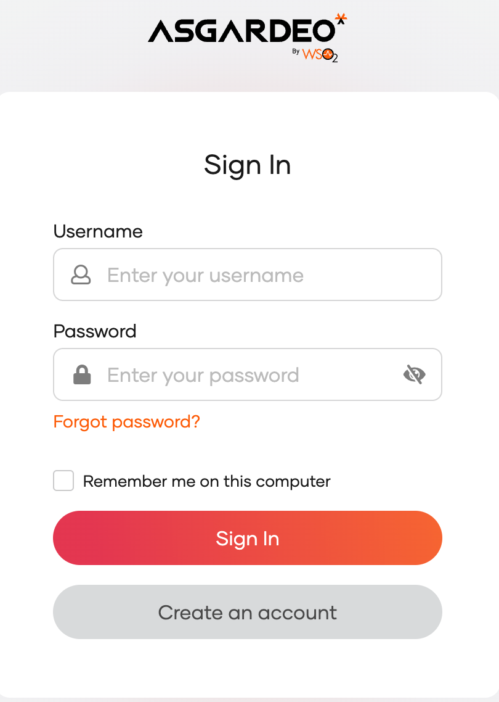

# Sample React SPA

By following this guide, you will be able to deploy a React single-page application (SPA) locally and secure it with OpenID Connect.

## Prerequisites

- **npm with Node.js**

    If you don't have it, [install npm and node](https://docs.npmjs.com/downloading-and-installing-node-js-and-npm){target="_blank"} in your local environment.

- **A user account in Asgardeo**

    If you don't already have one, [create a user account]({{base_path}}/guides/users/manage-users/#onboard-a-user) in Asgardeo.

## Register the app

Follow the steps given below to register the sample React SPA in Asgardeo.

1. On the [Asgardeo Console](https://console.asgardeo.io/login), go to **Applications**.

2. Click **New Application** and select **Single-Page Application**

3. Enter the following details:

    {: width="700" style="display: block; margin: 0; border: 0.3px solid lightgrey;"}

    <table>
        <tr>
            <td>Name</td>
            <td>Give a unique name to identify your application.</td>
        </tr>
        <tr>
            <td>Authorized redirect URLs</td>
            <td>
                <p>The URL to which the user is redirect to after a successful login. Use the following URL for this sample app:</p>
                <code>https://localhost:3000</code>
            </td>
        </tr>
        <tr>
            <td>Allow sharing with organizations</td>
            <td>Enable this to share the new application with all or any selected organizations that belong to your organization (root).</td>
        </tr>
    </table>

4. Click **Register** to complete the registration.
5. Go to the **Protocol** tab and take note of the **Client ID**. You will need it to configure the application later.

    {: style="display: block; margin: 0; border: 0.3px solid lightgrey;"}

!!! tip
    To provide a better experience for the user, it is recommended to configure an access URL for the application. You can set an access URL from the **General** tab of the application. (For this sample application, the access URL is <code>https://localhost:3000</code>).

    The access URL is used,

    - in the application catalog and discovery flows.
    - to redirect the user back to the application in the following scenarios.
        - if the login page times out
        - after a password reset
        - after the self sign-up verification
    - to re-initiate the login flow if the login flow fails.

## Download the sample

Click the button below to download the sample. You can also choose to view the source before doing so.

<div class="centered-container">
  <div class="border-text">
    <br>
    <a href="https://github.com/asgardeo/asgardeo-auth-react-sdk/releases/latest/download/asgardeo-react-app.zip" target="_blank">Download sample</a>
  </div>

  <div class="border-text">
    <br>
    <a href="https://github.com/asgardeo/asgardeo-auth-react-sdk/tree/main/samples/asgardeo-react-app" target="_blank">View source</a>
  </div>
</div>

## Configure the sample

Follow the steps given below to configure the sample app.

1. Unzip the application folder.

2. Go to the `asgardeo-react-app/src/` folder and open the `config.json` file in a text editor.

3. Update the following in the `config.json` file:

    ```json

    {
    "clientID": "{client ID}",
    "baseUrl": "https://api.asgardeo.io/t/{organization_name}",
    "signInRedirectURL": "https://localhost:3000",
    "signOutRedirectURL": "https://localhost:3000",
    "scope": [ "profile" ]
    }

    ```

    <table>
    <thead>
      <tr>
         <th>Configuration</th>
         <th>Description</th>
      </tr>
   </thead>
   <tbody>
      <tr>
        <td>
            <code>clientID</code>
        </td>
        <td>
            The client id that you received when you registered the application in Asgardeo.
        </td>
      </tr>
      <tr>
        <td>
            <code>baseUrl</code>
        </td>
        <td>
            <p>All authentication requests that the client application makes to Asgardeo will be appended to this base URL.:</p>
            <code>https://api.asgardeo.io/t/{organization_name}</code>
        </td>
      </tr>
      <tr>
        <td>
            <code>scope</code>
        </td>
        <td>
            <p>The list of OIDC scopes that are used for requesting user information. You can add OIDC scopes such as <code>profile</code> and <code>email</code> in a comma-separated list as follows: </p>
            <code>"scope": ["profile", "email"]</code>
            <p>Learn more about [OIDC scopes in Asgardeo]({{base_path}}/guides/users/attributes/manage-scopes/).</p>
        </td>
      </tr>
    </tbody>
    </table>

## Run the sample

Follow the steps given below to run the sample.

1. On your terminal, navigate to the **root** of the project and run the command given below to start the sample application:

    ```bash
    npm install && npm start
    ```

2. Once the app is successfully compiled, it is accessible at `https://localhost:3000`.

3. Click **Login**. You will be redirected to the Asgardeo login page.

    {: width="350" style="display: block; margin: 0; border: 0.3px solid lightgrey;"}

4. Enter the credentials of your user account and click **Sign In**.

    !!! note "Extend your login session"
        By default, the user login session is active for only `15 minutes`. You can extend the session to `14 days` by selecting the **Remember me on this computer** option provided at the login screen of your application.