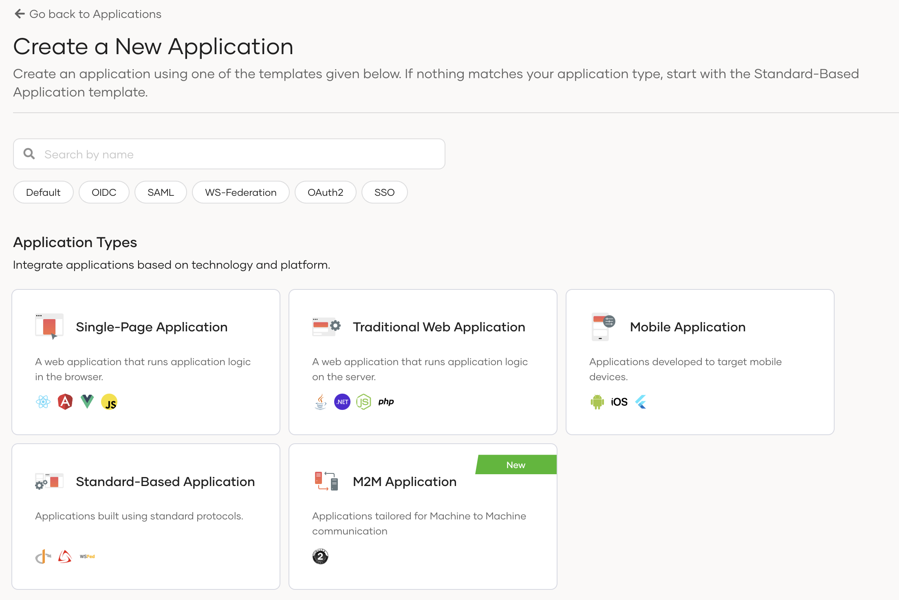
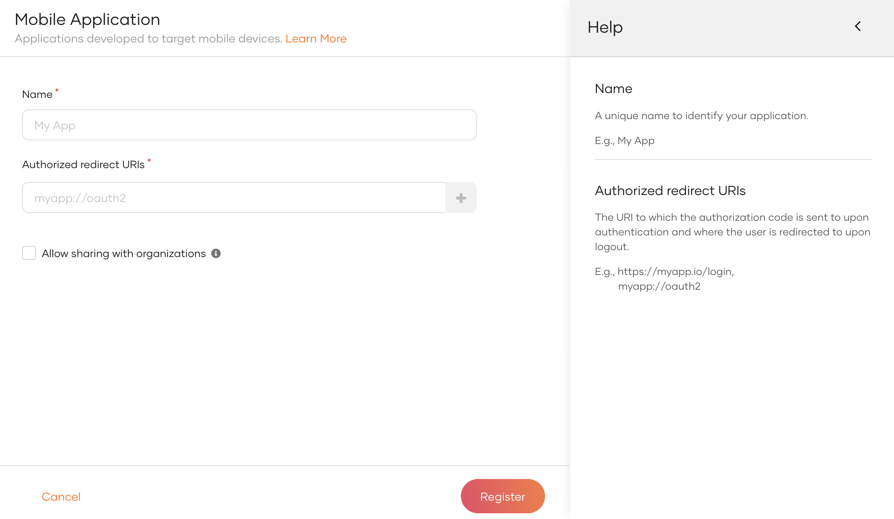
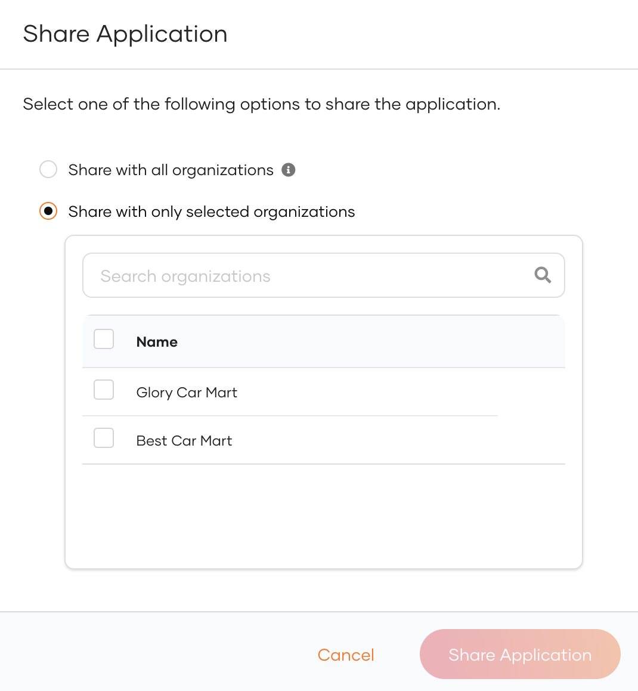

# Register a mobile app

To add login to your mobile application with Asgardeo, you need to first register your app in Asgardeo.

Your app will be registered as an OpenID Connect mobile app and a client ID will be issued. Note that client secrets are not issued for mobile apps since they are public clients. However, the [PKCE (Proof Key for Code Exchange)](../../references/app-settings/oidc-settings-for-app/#proof-key-for-code-exchange-pkce) extension is enabled by default as a security measure.

## Register the app

To register the app:

1. On the Asgardeo Console, go to **Applications**.

2. Click **New Application** and select **Mobile Application**.

    {: width="700"}

3. Enter the following details:

    {: width="700"}

    <table>
        <tr>
            <th>Parameter</th>
            <th>Description</th>
        </tr>
        <tr>
            <td>Name</td>
            <td>A unique name to identify your application.</td>
        </tr>
        <tr>
            <td>Authorized redirect URLs</td>
            <td>The URL to which the authorization code is sent to upon user authentication and where the user is redirected to upon logout.</td>
        </tr>
        <tr>
            <td>Allow sharing with sub-organizations</td>
            <td>Enable this to share the new application with all or any selected suborganizations that belong to your root organization.</td>
        </tr>
    </table>

5. Click **Register** to complete the registration.

    !!! note
        If you have enabled **Allow sharing with sub-organizations** while registering the application, you will see a popup window with the following options.

        {: width="500"}

        <table>
            <tr>
                <th>Option</th>
                <th>Description</th>
            </tr>
            <tr>
                <td>Share with all sub-organizations</td>
                <td>If selected, the application will be shared with all existing suborganizations and any new suborganizations you may create in the future.</td>
            </tr>
            <tr>
                <td>Share with only selected sub-organizations</td>
                <td>If selected, you can select the suborganizations you wish to share the application with.</td>
            </tr>
        </table>

## Get the client ID

When you register your mobile application, a client ID is generated. Your mobile application will identify itself to {{ product_name }} with this client ID.

You can get this client ID from the **Protocol** tab of the application as shown below.

{: width="700"}

## What's next?

- [Add login to your mobile app](../../guides/authentication/add-login-to-mobile-app/)