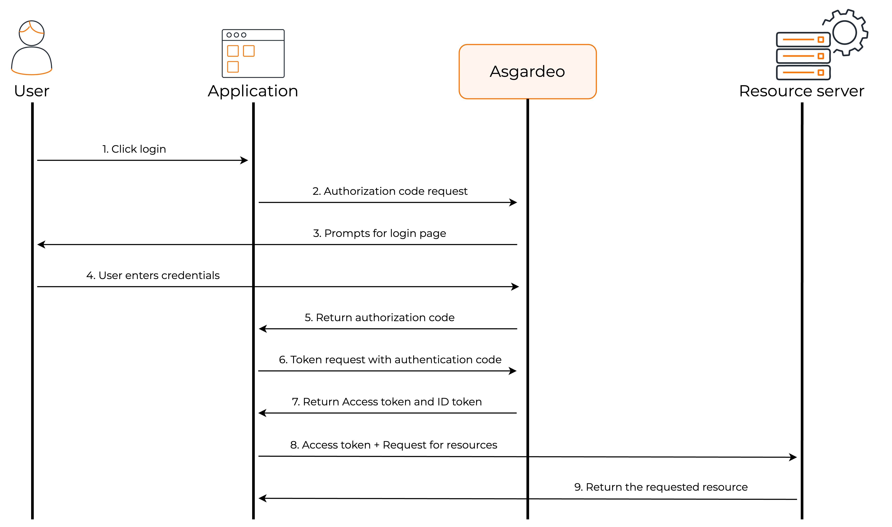
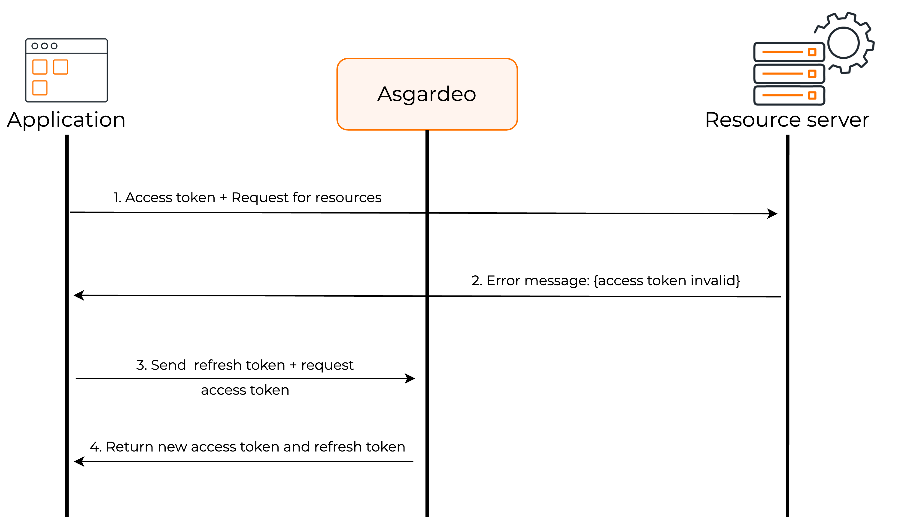
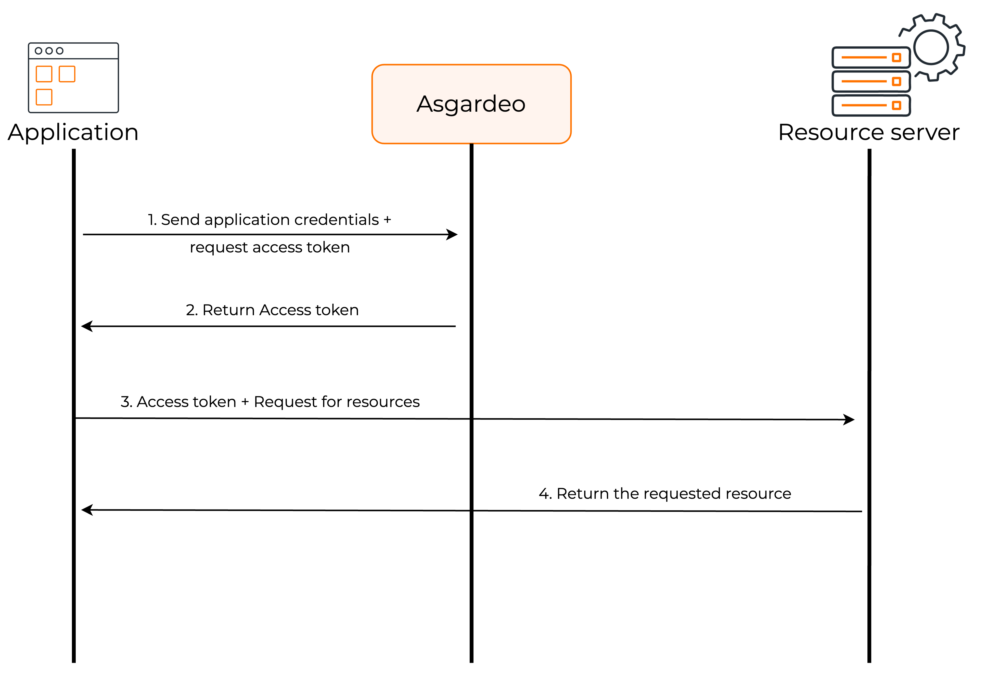
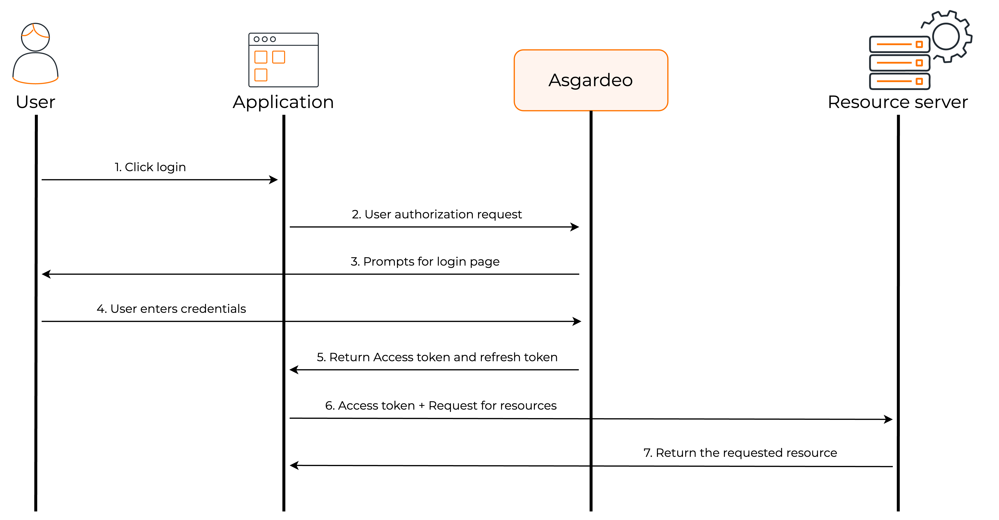
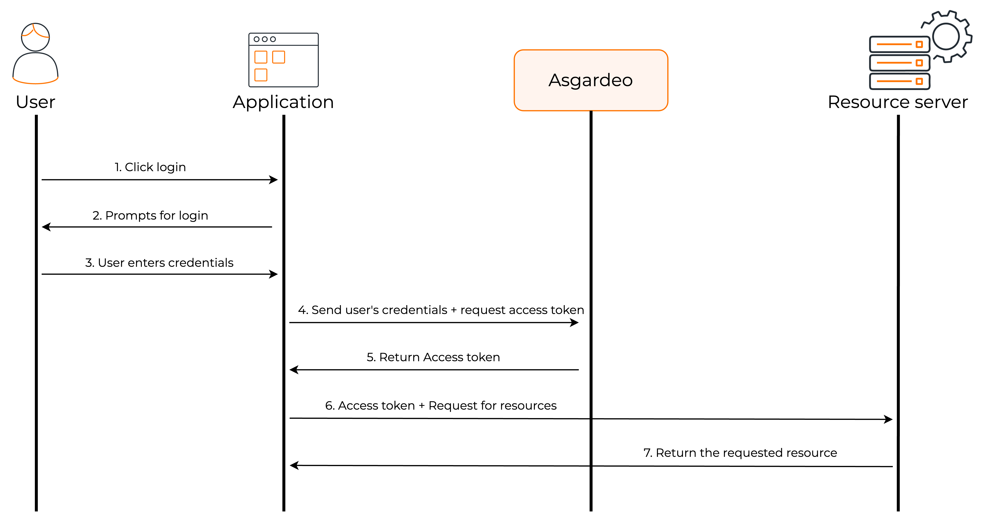

# OAuth2 grant types of Asgardeo applications

OAuth 2.0 defines several grant types used to obtain an access token, which is required to access protected resources on behalf of a user or an application. Each grant type is designed for a specific use case and supports different parameters.

The grant types supported by Asgardeo applications are as follows:

**OAuth 2.0 grants**
- [Authorization code grant](#authorization-code-grant)
- [Refresh token grant](#refresh-token-grant)
- [Client credentials grant](#client-credentials-grant)
- [Implicit grant](#implicit-grant)
- [Password grant](#password-grant)

**Asgardeo's custom grants**
- [Organization switch grant](#organization-switch-grant)

## Authorization code grant

The Authorization code flow provides a secure way for a client application to obtain an access token without exposing the user's credentials to the client application. The user only authenticates with the authorization server, which then issues an authorization code that can be exchanged for an access token.

This helps to protect the user's credentials and prevents them from being compromised by malicious client applications.

The following diagram shows how the authorization code flow works.

1. The user visits the client application and requests for login through Asgardeo.
2. The client application redirects the authorization code request to Asgardeo.
3. Asgardeo prompts the user to enter credentials.
4. The user enters the credentials.
5. After successful authentication, Asgardeo sends the authorization code to the client application.
6. The client application uses this authorization code to request an access token from Asgardeo.
7. Asgardeo sends the access token and ID token to the client application.
8. The client application can now request user information from the resource server by providing the access token.
9. The resource server returns the requested user information to the client application.

## Refresh token grant
The refresh token grant provides a secure way for client applications to obtain a new access token without requiring the user to re-authenticate. This can help improve the user experience by avoiding unnecessary login prompts and reducing the load on the authorization server by reducing the frequency of authentication requests.
Refresh tokens typically have a longer lifetime than access tokens, and the user or the authorization server can revoke them at any time.

The following diagram shows how the refresh token flow works.

1. The client application requests user information from the resource server by providing the access token.
2. As the access token is expired, the resource server returns an error message.
3. By sending the refresh token, the client application requests a new access token from Asgardeo.
4. Asgardeo sends a new access token and a new refresh token.

## Client credentials grant

The client credentials flow provides a secure way for client applications to obtain an access token without user authentication. This can be useful in scenarios where the client application needs to access its own resources, such as data storage or APIs, but does not require access to user data.
However, it is important to ensure that the client credentials are kept secure, as any party that posses these credentials can obtain access tokens and access the client's resources.

The following diagram shows how the client credentials grant flow works.

1. The client application sends its credentials (`client_id` and `client_secret`) to Asgardeo and requests an access token.
2. Asgardeo sends the access token to the client application.
3. The client application can now request user information from the resource server by providing the access token.
4. The resource server returns the requested user information to the client application.

## Implicit grant

!!! note
    Asgardeo does not recommend using implicit grant in it's applications.

The implicit grant flow is an OAuth 2.0 grant type that enables a client application to obtain an access token directly from the authorization server without an intermediate authorization code exchange. This flow is commonly used in browser-based applications where the client application runs in a web browser.

However, it is important to note that the access token is exposed in the browser's URL fragment, which can make it vulnerable to certain types of attacks, such as cross-site scripting (XSS). As a result, this flow is typically not recommended for applications that require high security.

The following diagram shows how the implicit grant flow works.

1. The user visits the client application and requests for login through Asgardeo.
2. The client application redirects the authorization request to Asgardeo.
3. Asgardeo prompts the user to enter credentials.
4. The user enters the credentials.
5. After successful authentication, Asgardeo sends the access token to the client application.
6. The client application can now request user information from the resource server by providing the access token.
7. The resource server returns requested user information to the client application.

## Password grant
The password grant flow is an OAuth 2.0 grant type that enables a client application to obtain an access token by presenting the user's username and password directly to the authorization server. This flow is generally considered less secure than other grant types, as it requires the client application to handle and transmit the user's credentials.

The password grant is primarily used in scenarios where the client application is highly trusted, and the user experience is prioritized over security concerns. It is generally not recommended for use in public-facing applications or scenarios where sensitive data is accessed.

The following diagram shows how the password grant flow works.

1. The user visits the client application and requests for login through Asgardeo.
2. The client application requests the user's credentials.
3. The user sends the requested credentials to the client application.
4. The client application sends the user's credentials and requests an access token from Asgardeo.
5. Asgardeo sends the access token to the client application.
6. The client application can now request user information from the resource server by providing the access token.
7. The resource server returns the requested user information to the client application.

## Organization switch grant

The organization switch grant is a custom grant type in Asgardeo that enables users to switch between different organizations in a hierarchical organization structure.

Client applications should always use one of the traditional grant types to authorize user access. The organization switch grant is also required when the authorization request is for resources of a suborganization. That is because it is necessary to switch between the root organization and the suborganization to obtain access tokens that are valid for suborganizations.

The following diagram illustrates this flow.

1. The user visits the client application and requests login through the root organization.
2. The client application redirects the authorization code request to the root organization.
3. Asgardeo prompts the login page of the root organization's application.
4. The user selects the **Organization Login** authentication option.
5. The root organization prompts the user to enter the suborganization name.
6. The user enters the suborganization name.
7. The root organization sends an authorization code request to the suborganization.
8. The suborganization prompts the user to enter credentials.
9. The user enters the credentials.
10. The suborganization sends the authorization code to the root organization.
11. The root organization uses this authorization code to request an access token from the suborganization.
12. The suborganization sends the access token and ID token to the root organization.
13. The root organization sends the authorization code to the client application.

    !!! note
        This is the response to the authorization code request in step two.

14. The client application uses this authorization code to request an access token from the root organization.
15. The root organization sends the access token and ID token to the client application.
16. The client application exchanges the access token received in the above step for an access token for the suborganization.
17. The root organization initiates an exchange for an access token and sends an access token against the suborganization to the client application.
18. The user requests information from the client application.
19. The client application requests user information from the suborganization by providing the access token received in step 17.
20. The suborganization returns requested user information to the client application.