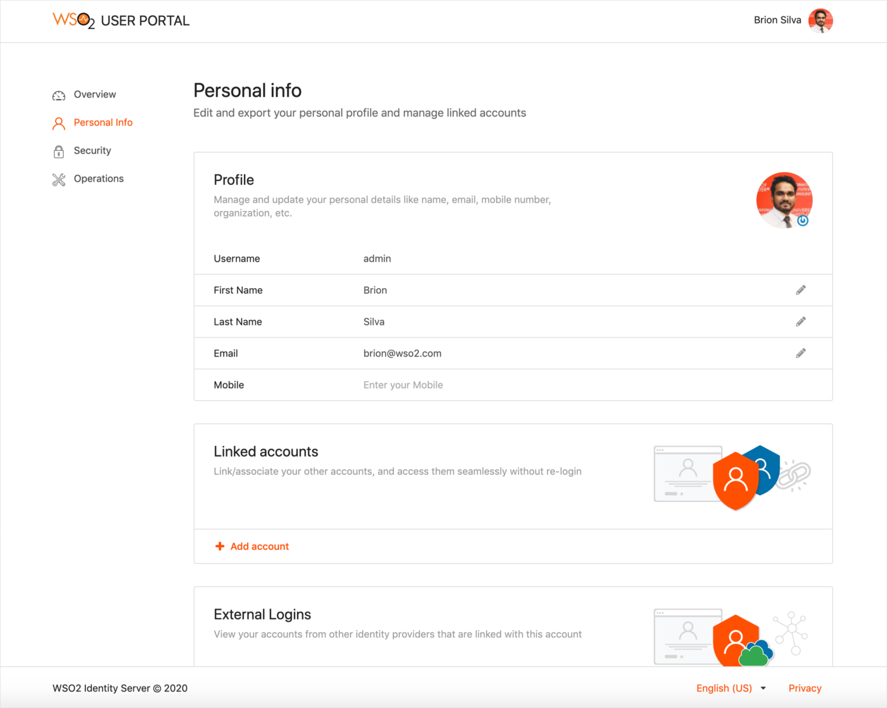

# Customizing the My Account UI

From [WSO2 Identity Server 5.10.0](https://wso2.com/identity-and-access-management/) onwards, a new **My Account** has been introduced which is the successor to the dashboard. It also adheres to the UI extensions scheme
 introduced with WSO2 Identity Server 5.9.0 to use a centralized theming for all the front-end portals.

!!! note
    The **My Account** application has been renamed as **My Account** from this release onwards.

This section explains how we can customize the theming of **My Account**.

!!! info
    A customized version of the [default theme](https://github.com/Semantic-Org/Semantic-UI-LESS/tree/master/themes/default) in the Semantic UI LESS package has been used to
    achieve the look and feel of the **My Account**.

    

    For information on the Semantic UI theming, see [Semantic UI documentation](https://semantic-ui.com/usage/theming.html).

## Before you begin

1. Check out the corresponding identity apps source code from the [repo](https://github.com/wso2/identity-apps)
and set it up in the developer environment. 

    !!! info  
        - See the instructions on [setting up My Account in a development environment](../../develop/setting-up-my-account-in-a-dev-environment).
        - When you build the `identity-apps` repo (as explained in the instructions on setting up the developer environment), be sure to check out the `5.11.0` branch:
           ```java
           $ git checkout 5.11.0
           ```

2. Navigate to the `modules/theme/src/themes` folder within identity-apps. All the theme global variable overrides
can be found in the `modules/theme/src/themes/default/globals/site.variables` file. For the full set of variables,
    see the [original theme variables file](https://github.com/Semantic-Org/Semantic-UI-LESS/blob/master/themes/default/globals/site.variables).

---

Follow the steps given below to further customize **My Account**. 

## Step 1: Change the primary color of the portal

To change the primary color of the portal, the variables in the `modules/theme/src/themes/default/globals/site.variables` file need to be overridden.

1.  Add a new variable under 'Site Colors' and give it a value as shown below. In this example, the variable is `facebookBlue`.

    ```java
    /*-------------------
        Site Colors
    --------------------*/

    @facebookBlue     : #2d88ff;
    ```

2.  Now, change the primary color variable to refer the site color variable you defined above.

    ```java
    /*-------------------
        Brand Colors
    --------------------*/

    @primaryColor        : @facebookBlue;
    ```

3.  Next, add a new variable under 'Brand Colors' and give it a value as shown below. In this example, the variable name is `globalBackgroundColor`. This will be used to change the background color from white to dark gray.

    ```java
    /*-------------------
        Brand Colors
    --------------------*/

    @globalBackgroundColor: #18191a;
    ```

4.  Now, change the page background color (by using the `globalBackgroundColor` variable defined above) and the text color. 

    ```java
    /*-------------------
            Page
    --------------------*/

    @pageBackground      : @globalBackgroundColor;
    @textColor           : #e4e6eb;
    ```

5.  Build the `theme` module by running the following command and check the results reflected on the dev server.

    ```java
    # from inside `modules/theme`
    $ npm run build
    ```
    The response should be similar to the screenshot given below. 

    
    
The background color of the header, footer, side navigation, and content cards can be changed by following the steps given below.

1. To change the header and footer background colors: 
    1.  Add a new variable to the 'Brand Colors' section in the `modules/theme/src/themes/default/globals/site.variables` file and give it a value as shown below. This variable is named `globalForegroundColor` in this example.

        ```java
        /*-------------------
            Brand Colors
        --------------------*/

        @globalForegroundColor: #1d2630;
        ```
    
    2. Add the color defined in the step above (`globalForegroundColor`) to the Menu, App Header, and App Footer sections as shown below.

        ```java
        /*******************************
                    Menu
        *******************************/

        @background: @globalForegroundColor;
        ```
        ```java
        /*-------------------
            App Header
        --------------------*/

        @appHeaderBackground: @globalForegroundColor;
        ```

        ```java
        /*-------------------
            App Footer
        --------------------*/

        @appFooterBackground: @globalForegroundColor;
        ```

2.  To change the side panel background, apply the following to the `modules/theme/src/themes/default/collections/menu.overrides` file:

    ```java
    .ui.vertical.menu {
        &.side-panel {
            background: @globalBackgroundColor;

            // Other styles
        }
    }
    ```

8.  To change the content card background color, apply the following to the `modules/theme/src/themes/default/views/card.variables` file:

    ```java
    @background: @globalForegroundColor;
    ```

9.  The status can be checked by rebuilding the theme module.

    ```java
    # from inside `modules/theme`
    $ npm run build
    ```

The changes should be reflected on the running dev server in no time. A sample screen of the new theme is shown below.


## Step 2: Deploy the changes in the web app

The final step of the process is the deployment. Follow the sequence of steps listed below to deploy
the changes performed in the previous steps.

1.  Build the theme module.

    ```java
    # from inside modules/theme
    $npm run build
    ```

2.  Copy the artifacts to the web app.

    The built artifacts will be available inside the `modules/theme/dist/lib/themes` folder. Copy everything to the clipboard and
    navigate to **my-account** web app in the WSO2 IS pack.

    Copy everything to the clipboard and paste it inside the
    `<IS_HOME>/repository/deployment/server/webapps/myaccount/libs/themes` folder.
    
    !!! warning
        Make sure that you keep a backup of the original CSS folder.

<!--
The final theme should look similar to following.


-->
