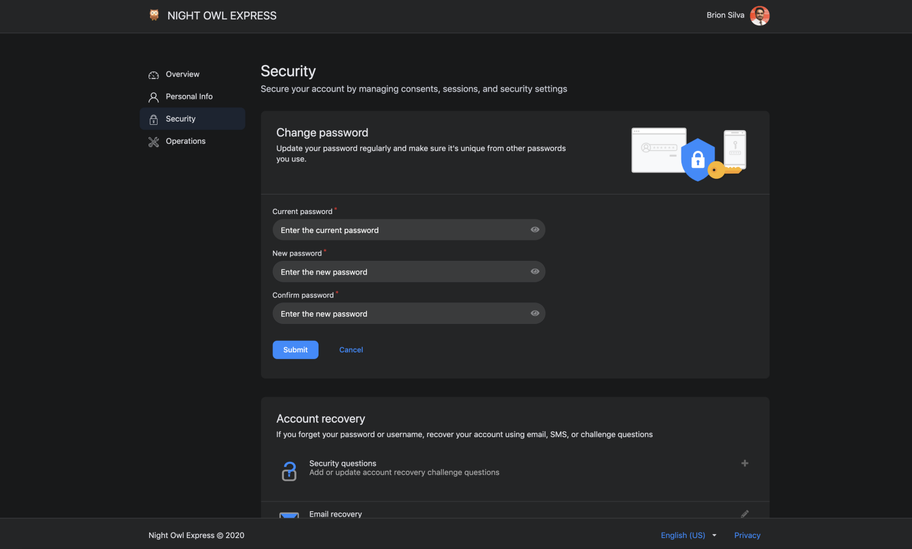
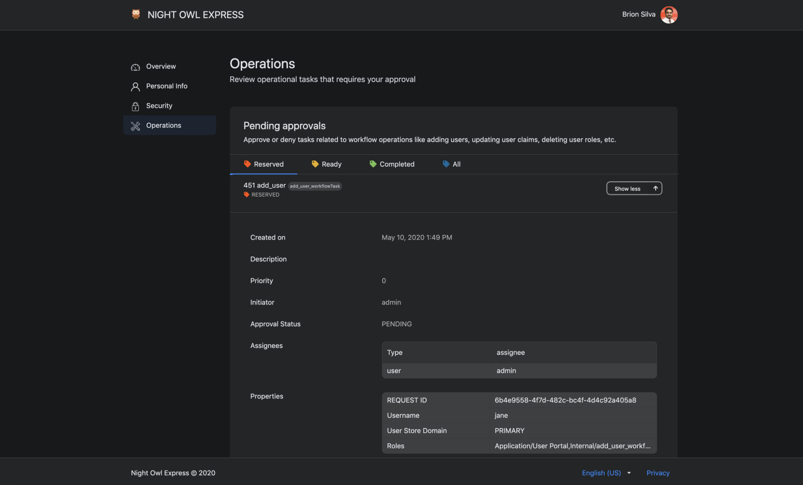

# Customizing the User Portal UI

From [WSO2 Identity Server 5.10.0](https://wso2.com/identity-and-access-management/) onwards, a new  much-anticipated
 User Portal has been introduced which is the successor to the dashboard. It also adheres to the UI extensions scheme
 introduced with WSO2 Identity Server 5.9.0 to use a centralized theming for all the front-end portals.

Let's see how we can customize the theming of User Portal.

## Changing the default theme to dark mode


!!! info
    A customized version of the [default theme](https://github
    .com/Semantic-Org/Semantic-UI-LESS/tree/master/themes/default) in the Semantic UI LESS package has been used to
    achieve the look and feel of the User Portal which is packed with 5.10.0 distribution.

    

    Check the [Semantic UI documentation](https://semantic-ui.com/usage/theming.html) if you wish to learn more about
     Semantic UI theming.

!!! note "Before you begin"

    1. Check out the corresponding identity apps source code from the [repo](https://github.com/wso2/identity-apps)
    and set it up in the [development environment]((../../develop/setting-up-user-portal-in-a-dev-environment)). You
    can check out the `v1.0.72` tag since `v1.0.72` of identity-apps was used in IS 5.10.0
    ```java
        $ git fetch --all --tags --prune
        $ git checkout tags/v1.0.72 -b feature-dark-theme-demo
    ```

    2. Navigate to `modules/theme/src/themes` folder inside identity-apps. All the theme global variable overrides can be
    found in `modules/theme/src/themes/default/globals/site.variables` file and for the full set of variables, refer the
    original theme variables [file](https://github
    .com/Semantic-Org/Semantic-UI-LESS/blob/master/themes/default/globals/site.variables).

### Step 1: Changing the primary color of the portal

In order to change the primary color of the portal, you need to override the variables in `site.variables`.

1.  Add a new color under the site colors and let’s call it facebookBlue.
```java
    /*-------------------
        Site Colors
    --------------------*/

    @facebookBlue     : #2d88ff;
```
2. Now change the primary color variable.
```java
    /*-------------------
        Brand Colors
    --------------------*/

    @primaryColor        : @facebookBlue;
```
3. Next, we can change the page background color from white to dark gray and change the default text color to a
lighter shade. Add a new variable under the brand colors and let’s call it globalBackgroundColor.
```java
    /*-------------------
        Brand Colors
    --------------------*/

    @globalBackgroundColor: #18191a;
```
4. Override the @pageBackground variable.
```java
    /*-------------------
            Page
    --------------------*/

    @pageBackground      : @globalBackgroundColor;
    @textColor           : #e4e6eb;
```
5. You can now build the theme module by running the following command and check the results reflected on the dev server.
    ```java
        # from inside `modules/theme`
        $ npm run build
    ```
    You will see something like the following.
    
    As you can see, we have to change the backgrounds of the header, footer, side navigation, and content cards.

6.  In order to change the header and footer background, add a new variable under the brand colors and let’s call it
globalForegroundColor.

    In `modules/theme/src/themes/default/collections/menu.variables`
    ```java
        @background: @globalForegroundColor;
    ```


7.  Change The side panel background. In `modules/theme/src/themes/default/collections/menu.overrides`
```java
    .ui.vertical.menu {
        &.side-panel {
            background: @globalBackgroundColor;

            // Other styles
        }
    }
```

8.  Modify the content card background color. In `modules/theme/src/themes/default/views/card.variables`
```java
   @background: @globalForegroundColor;
```
You can check the status by rebuilding the theme module. The changes should be reflected on the running dev server in
 no time. It would look similar to following.


### Step 2: Changing the branding

Now that we are done with the styling, let’s change the product branding.

1.  Change the product logo.

    ### Method 1 (Recommended)

    If you wish to change the logo without touching the compiled javascript bundle, you can do the following to
    override the existing WSO2 logo with CSS.

    1.  Add an icon downloaded from [Flaticon.com](https://www.flaticon.com/) to the
    `modules/theme/src/themes/default/assets/images` folder(owl
    .svg).

    2.  In `modules/theme/src/definitions/globals/product.less` replace the existing styles in .product-logo
    class with the following.
        ```java
            .product-title {
                .product-logo {
                    width: 25px;
                    height: 25px;
                    vertical-align: text-top;
                    margin-right: 5px;
                    background: url(assets/images/owl.svg) no-repeat;
                    background-size: auto;

                    svg {
                        display: none;
                    }
                }

                // Other styles
            }
        ```

    ### Method 2

    1. Add the downloaded icon to the `modules/theme/src/themes/default/assets/images` folder.
    2. In modules/theme/src/index.js replace Logo with the path to the new icon.
            ```java
                export const Logo = require("../lib/assets/images/owl.svg");
            ```
    3.  Build user-portal artifacts.
            ```java
                npx lerna run build — scope @wso2is/user-portal
            ```
    4. Replace **main.js** & **main.js.map** inside the **user-portal** web app with the same from
        `apps/user-portal/build/user-portal`.

2.  Change the product title & Copyright.

    In the IS pack, the **User Portal** web app is available in the path
    `<IS_HOME>/repository/deployment/server/webapps/user-portal`
    In index.jsp add the following two entries in the runConfig window object.
    ```java
        window["runConfig"] = {
            ...
            applicationName: "NIGHT OWL EXPRESS",
            copyrightText: "Night Owl Express © 2020"
        };
    ```

3.  Change the Favicon and Title.

    Replace favicon.ico at the root of the user-portal web app with the desired icon. You can use an online generator
     like [favicon.io](https://favicon.io/) to generate a favicon for free.

    To change the title, in **index.jsp** file of the web app, change the `<title>` tag.
    ```html
        <title>Night Owl Express</title>
    ```

### Step 3: Deploying the changes in the web app

We are at the final step of the process which is the deployment. Follow the sequence of steps listed below to deploy
the changes performed in the previous steps.

1.  Build the theme module.
```java
    # from inside modules/theme
    $npm run build
```
2.  Copy the artifacts to the web app.

    The built artifacts will be available inside the **lib** folder. Copy everything to the clipboard and navigate to
     the **user-portal** web app in the IS pack.
    user-portal web app is available in the location `<IS_HOME>/repository/deployment/server/webapps/user-portal`

    Replace the contents inside `/libs/styles/css` with the copied artifacts.
    !!! warning
        Make sure that you keep a backup of the original CSS folder.

The final theme should look similar to following.



