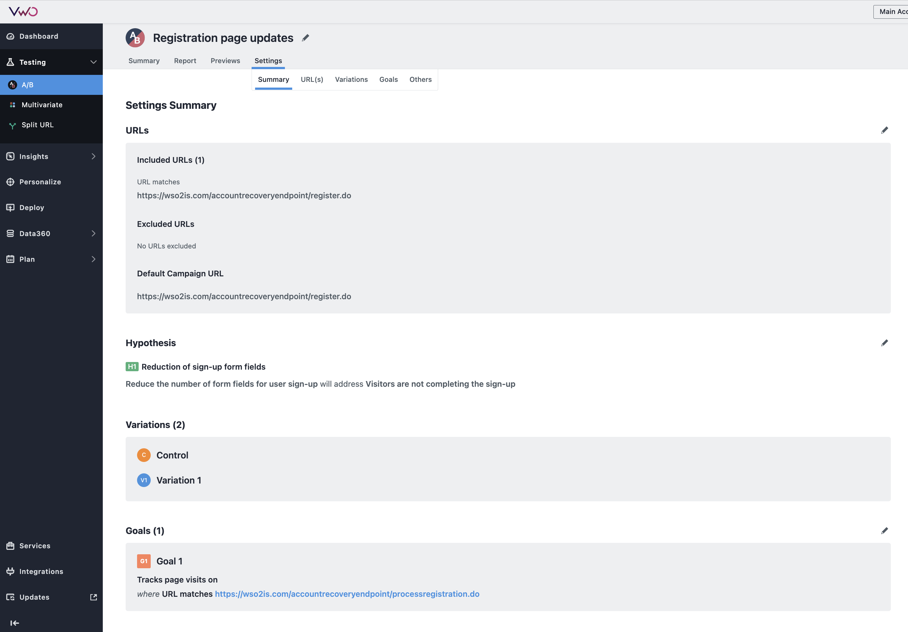
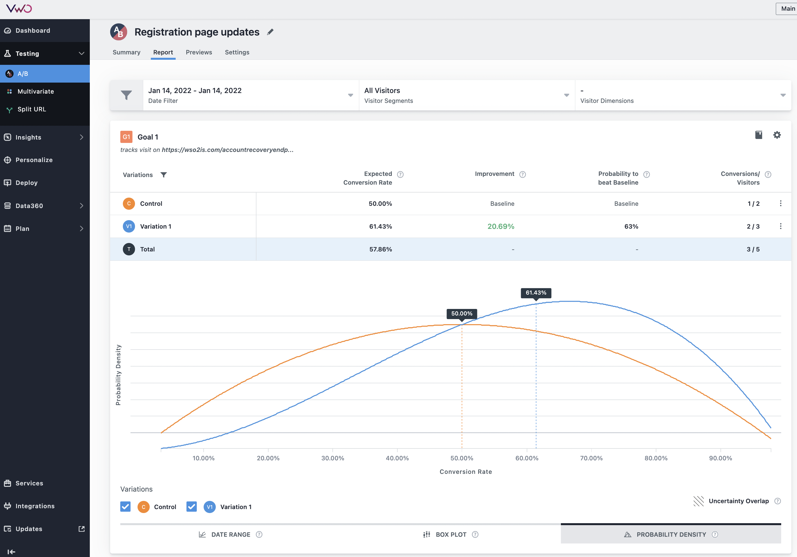

# A/B Testing

A/B testing is a method used for comparing two variants of a web page to 
determine which one performs better.

When you integrate your applications with WSO2 Identity Server for 
its’ identity and access management requirements, you can verify 
the usability of your application’s login pages etc., by running an A/B test.

For example, when you configure your application’s [self-registration](https://is.docs.wso2.com/en/latest/learn/self-registration/) 
flow, you may want to know which registration page layout would have
more conversion rates for user registrations or whether having a fewer
number of attributes during user registration would have better 
conversion rates. WSO2 Identity Server can easily integrate with 
[VWO](https://vwo.com/) to perform a/b testing.

## A/B Testing with VWO

1. Set up a test in VWO. 

    Note: See the VWO [knowledge base](https://help.vwo.com/hc/en-us/articles/360021171954-How-to-Create-an-A-B-Test-in-VWO-) for instructions.

2. Get the **smart code** provided for the test.
3. Add the smart code as instructed in the test to the identified web pages in WSO2 Identity Server.

A sample test configured for the self registration page would look like this in VWO:

A report like below can be seen with the test results:

