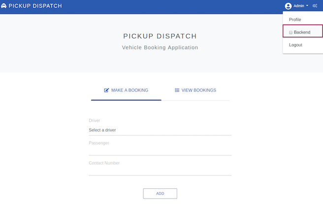

# Configuring Access Delegation with OAuth 2.0

### Introduction

This tutorial demonstrates how WSO2 Identity Server (WSO2 IS) can be used as an OAuth 2.0 authorization server. It guides you through the OAuth 2.0 application configuration, deployment, and the usage scenario.

In this sample scenario, a user tries to login to a vehicle booking web application called "pickup-dispatch" via a WSO2 Identity Server and recieves an access token to call the API to view the vehicle bookings.


### Setting up

1. [Download WSO2 Identity Server](https://wso2.com/identity-and-access-management/).

2. Navigate to `<IS_HOME>/bin` and start the server by executing one of the following commands.

    ``` java tab="Linux"
    sh wso2server.sh
    ```

    ``` java tab="Windows"
    wso2server.bat run
    ```
	
3. Follow the steps in
   [deploying **pickup-dispatch** webapp](../../learn/deploying-the-sample-app/#deploying-the-pickup-dispatch-webapp)
   to download, deploy and register **dispatch** sample.

4. [Download](https://github.com/wso2/samples-is/releases/download/v4.1.0/backend-service-4.1.0.jar)
   the `backend-service.jar` file from the latest release assets.

5. Navigate to where the `backend-service.jar` file is located on a terminal window and run the following command to start the backend service.
    ```
    java -jar backend-service.jar -introspectionEnabled true
    ```
!!! Tip 
    For more information about the backend service, see [Introduction to Backend Service](https://github.com/wso2/samples-is/tree/master/etc/backend-service).

The setup is now complete and you can proceed to try out the scenario.

### Try it out

1. Run the application by visting the following URL: `http://localhost.com:8080/pickup-dispatch/index.jsp`

2. Login using the preferred credentials (e.g., admin/admin)

3. Next you have to provide consent to use your username.
Backend calls are disabled by default. Enable it by selecting the **Backend** box in the drop down list as shown below.

    

4. Add a new booking by selecting a driver from the drop down list and filling passenger details. 

5. Click **Add**. On the backend-service log, you will notice that the request sent to `http://localhost:39090/bookings` contains an authorization header.

6. You can click on the gear icon on the top-right corner to view the request and response. 

7. Similarly, you can also view stored bookings. This request also contains an Authorization header.

    