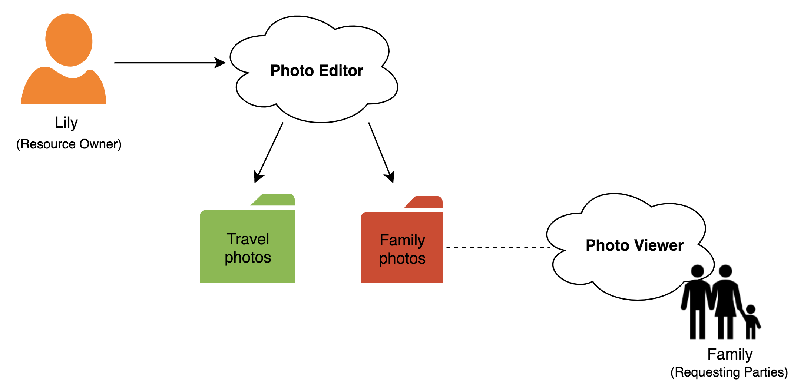

# Configuring Access Delegation with OAuth 2.0

User Managed Access (UMA) enables controlled access to a user's protected digital resources using a centralized authorization server with authorization policies. This tutorial demonstrates giving access to a user's photo resources in a sample application by configuring UMA 2.0 in WSO2 Identity Server.

## Scenario 

Lily, Oliver and Pam are three users in WSO2 IS. Lily has a photo album in the "Photo-editer" application and wants to share the Family photos album with her family members; Oliver and Pam . Oliver and Pam can view this photo album using the "Photo-viewer" application. Photo-editor and Photo-viewer applications are using WSO2 IS as their identity provider.
    


## Setting up

1. [Download WSO2 Identity Server](https://wso2.com/identity-and-access-management/).

2. Navigate to `<IS_HOME>/bin` and start the server by executing one of the following commands.

    ``` java tab="Linux/MacOS"
    sh wso2server.sh
    ```

    ``` java tab="Windows"
    wso2server.bat run
    ```
	
3. Follow the steps in
   [deploying the **photo-editor** and **photo-view** webapps](../../learn/deploying-the-sample-app/#deploying-the-photo-editor-and-photo-view-webapps)
   to download, deploy and register **Photo Editor** sample.

Once you have deployed the samples, note that two service providers have been created using dynamic client registration. You can access or edit them through the management console. 
    

## Create users

1. Log in using admin/admin credentials and create a new user called "Lily" (the resource owner) with login permission. For instructions, see [Adding Users and Roles](../../learn/adding-users-and-roles#create-a-user).

    !!! info
        `admin` is the default administrative user in WSO2 Identity Server.

2. Next, create two new users called "Pam" and "Oliver" (the requesting parties) with login permission. 

The setup is now complete and you can proceed to try out the scenario.

## Try it out

1. Run the application by visting the following URL: <http://localhost.com:8080/photo-edit>.

2. Log in to the **Photo Editor** application using Lily's credentials and provide the requested consent. 

3. Select the checkboxes and click **Share** to share the resources with Oliver and Pam.

    

4. Navigate to the following URL in an incognito browser window to access the Photo Viewer application: <http://localhost.com:8080/photo-view/>.

5. Log in to the **Photo Viewer** application using Oliver's credentials and provide the requested consent. 

6. Click **View Album** to view the shared resources.

    
