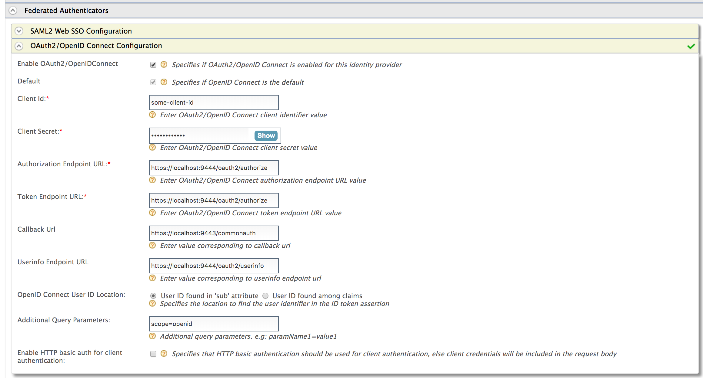

# Configuring OAuth2-OpenID Connect

[OAuth 2.0](https://oauth.net/2/) is an authorization framework that is
capable of providing a way for clients to access a resource with
restricted access on behalf of the resource owner. OAuth 2.0 is capable
of authorizing the flows for web applications, desktop applications, and
mobile applications among others.

OpenID Connect is an authentication protocol built on top of OAuth 2.0,
which facilitates clients to verify the end-user identity against the
authentication performed by an authorization server. At the same time,
it provides methods to transfer the end user information through claims.

With OAuth as its base, OpenID Connect allows many types of clients such
as web-based clients, mobile clients and javascript clients to verify
the users with an authorization server-based authentication.

1.  Sign in. Enter your username and password to log on to the
    [Management
    Console](../../setup/getting-started-with-the-management-console).
    
2.  Navigate to the **Main** menu to access the **Identity** menu. Click
    **Add** under **Identity Providers**.  
    For more information, see [Adding and Configuring an Identity
    Provider](../../learn/adding-and-configuring-an-identity-provider).
    
3.  Fill in the details in the **Basic Information** section.

4.  Expand the **Federated Authenticators** section and then the
    **OAuth2/OpenID Connect Configuration** form.  
    
        
    !!! note
        WSO2 Identity Server supports RP-initiated logout requests to OpenID Connect identity providers.
    
5.  Fill in the following fields where relevant.

    Prior to this, you need to configure an oauth application in the
    federated authorization server and get the application information
    such as client ID and secret. For example, see
    [configuring OAuth2-OpenID Connect single sign-on](../../learn/configuring-oauth2-openid-connect-single-sign-on).

    !!! tip
        By default, the **Client Id** and **Client Secret** are stored as
        plain text values, where the **Client Secret** is generally stored
        as a random number generated using two UUIDs and HMAC-SHA1 hash
        function, which is known to resist the strongest attack known
        against HMAC.
    
        If you want to change the format in which the **Client Secret** is
        stored, open the `	<IS_HOME>/repository/conf/deployment.toml	` file and add the following configuration.

        ```toml
        [oauth]
		hash_tokens_and_secrets = true 
		```
        For information on
        possible values that you can specify based on your
        requirement, see [Supported token persistence
        processors](../../learn/extension-points-for-oauth#token-persistence-processor).
    
        Once you configure a required token persistence processor, be sure
        to restart the server for the changes to be applied to WSO2 Identity
        Server.
    

    <div class="tg-wrap"><table>
    <thead>
    <tr>
        <th>Field </th>
        <th>Description</th>
        <th>Sample Value</th>
    </tr>
    </thead>
    <tbody>
    <tr>
        <td>Enable OAuth2/OpenIDConnect</td>
        <td>Selecting this option enables OAuth2/OpenID Connect to be used as an authenticator for users provisioned to the Identity Server.</td>
        <td>Selected</td>
    </tr>
    <tr>
        <td>Default</td>
        <td>Selecting the Default check box signifies that the OAuth2/OpenID Connect credentials are the main/default form of authentication. <br>This removes the selection made for any other Default checkboxes for other authenticators.</td>
        <td>Selected</td>
    </tr>
    <tr>
        <td>Authorization Endpoint URL</td>
        <td>This is a standard OAuth Authorization Endpoint URL of the federated IDP.</td>
        <td><code>https://localhost:9443/oauth2/authorize/</code></td>
    </tr>
    <tr>
        <td>Token Endpoint URL</td>
        <td>This is a standard OAuth Token Endpoint URL of the federated IDP.</td>
        <td><code>https://localhost:9443/oauth2/token/</code></td>
    </tr>
    <tr>
        <td>Client Id</td>
        <td>Client ID of the application you registered in the IDP for Identity Server.</td>
        <td><code>1421263438188909</code></td>
    </tr>
    <tr>
        <td>Client Secret</td>
        <td>Client Secret of the application you registered in the IDP for Identity server. Click the Show button to view the value you enter.</td>
        <td><code>12ffb4dfb2fed67a00846b42126991f8</code></td>
    </tr>
    <tr>
        <td>Callback URL</td>
        <td>This is the URL to which the browser should be redirected after the authentication is successful. It should be the <code>commonauth</code> endpoint of Identity server</td>
        <td><code>https://localhost:9443/commonauth</code></td>
    </tr>
    <tr>
        <td>OpenID Connect User ID Location</td>
        <td>Select whether the User ID is found in the 'sub' attribute that is sent with the OpenID Connect request or if it is found among claims.</td>
        <td>User ID found in 'sub' attribute</td>
    </tr>
    <tr>
        <td>Additional Query Parameters</td>
        <td>This is necessary if you are connecting to another Identity Server or application. Sometimes extra parameters are required by this IS or application so these can be specified here.
        <div class="admonition note">
        <p>If you wish to send query parameters that need to be updated dynamically with each OIDC request, the value needs to be defined within parenthesis.This value should be the key of the query parameter sent in the OIDC request URL. </br>
        <strong>Format:</strong> <code> login_hint={paramName}</code> </br>
        </br>
        Multiple parameters can be defined by separation of query parameters using the & character.</br>
        <strong>Sample:</strong></br> <code>login_hint={paramName}&scope=openid email profile </code></br> </br>
        Alternatively, use the following format to send query parameters that are resolved using an adaptive authentication script. </br>
        <strong>Format:</strong> <code>login_hint=$authparam{paramName} </code> </br>
        </p>
        </div>
        </td>
        <td>paramName1=value1</td>
    </tr>
    </tbody>
    </table></div>

!!! info "Related Topics"

	-   Identity Federation is part of the process of configuring an
		identity provider. For more information on how to configure an
		identity provider, see [Configuring an Identity
		Provider.](../../learn/adding-and-configuring-an-identity-provider)
	-   See [Log into Identity Server using another Identity Server -
		OAuth2](../../learn/login-to-identity-server-using-another-identity-server-oauth2)
		for a sample of using OAuth2/OpenIDConnect for federated
		authentication.
