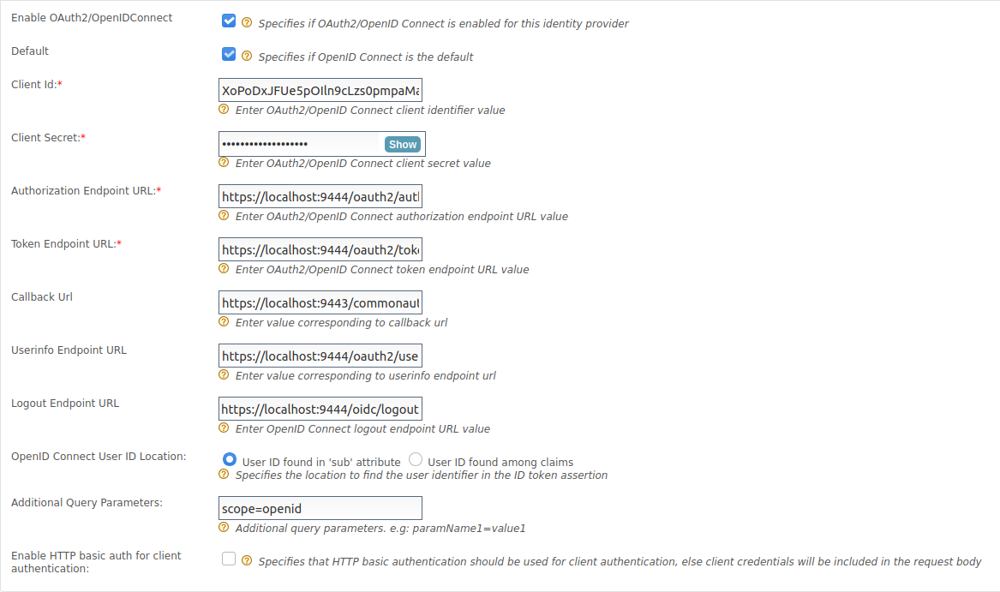
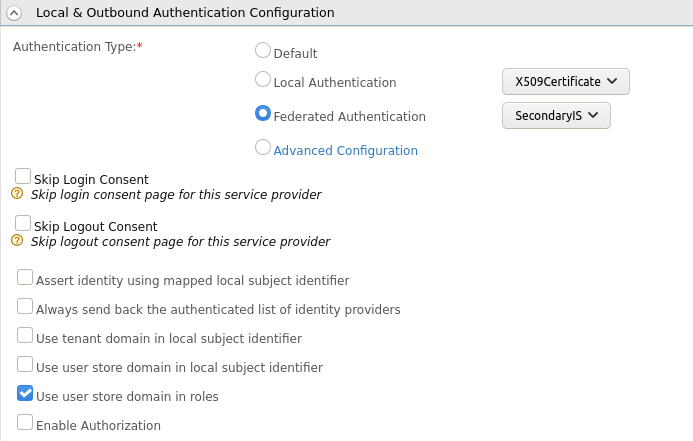

# Configuring OIDC Federated IdP Initiated Logout

WSO2 Identity Server (WSO2 IS) supports handling logout requests from OIDC federated identity providers. When the OIDC
logout request is received by the federated identity provider, WSO2 IS processes the request, terminates the sessions
and then responds to the identity provider.

## Scenario

The diagram below illustrates the OIDC federated identity provider initiated logout scenario. WSO2 IS, Application 2 are
configured as service providers in the OIDC provider. OIDC provider is configured as an identity provider and
Application 1 is configured as a service provider in the WSO2 IS. When the user initiates the logout from Application 2,
first the federated OIDC provider handles the request and propagates the logout request to WSO2 IS. After receiving the
logout request from the federated identity provider, WSO2 IS processes the request and terminates the sessions and sends
back a valid logout response.


## Trying out the flow with WSO2 Identity Server

To demonstrate the OIDC federated identity provider initiated logout, this tutorial uses two WSO2 identity servers which
are running on port 9443 (Primary IS) and 9444 (Secondary IS), and two sample web applications, “Pickup-Dispatch” and
“Pickup-Manager”. In this scenario Secondary IS acts as a federated OIDC identity provider and “Pickup-Dispatch” and
“Pickup-Manager” acts as Application 1 and Application 2. Following section provides a guide for configuring the OIDC
federated identity provider initiated logout and trying it out with the sample applications.

1. Configure Primary IS as a Service Provider in the Secondary IS
2. Configuring Secondary IS as an Identity Provider in the Primary IS
3. Configuring Pickup Dispatch application in the Primary IS
4. Configuring Pickup Manager application in the Secondary IS

> Note - Since there can be issues with cookies due to same hostname in both WSO2 identity servers, follow the
> https://is.docs.wso2.com/en/latest/setup/changing-the-hostname guide to change the hostname of the Secondary IS. In this guide hostname of the SecondaryIS is configured as “localhost.com”.

### Configure Primary IS as a Service Provider in the Secondary IS

1. Run the WSO2 Identity Server on port 9444 (Secondary IS).
2. Log in to the management console as an administrator using the admin,admin credentials.
3. Navigate to **Main** to access the **Identity** menu.
4. Click **Add** under **Service Providers**.
5. Fill in the details in the **Basic Information** section. Give a suitable name for the Service Provider like
   “PrimaryIS” and click **Register**.
6. Expand the **OAuth2/OpenID Connect Configuration** section under the **Inbound Authentication Configuration** section
   and click **Configure**.
7. Add https://localhost:9443/commonauth as **Callback Url**.

   

8. Tick the **Enable OIDC Back-channel Logout** checkbox and add https://localhost:9443/identity/oidc/slo as **
   Back-channel Logout Url**.

   

9. Click the **Add** button. Note the generated OAuth Client Key and Secret.

### Configuring Secondary IS as an Identity Provider in the Primary IS

1. Run the WSO2 Identity Server on port 9443 (Primary IS).
2. Log in to the management console as an administrator using the admin,admin credentials.
3. Navigate to **Main** to access the **Identity** menu.
4. Click **Add** under **Identity Providers**.
5. Fill in the details in the **Basic Information** section. Give a suitable name for the Identity Provider.
6. Expand the **OAuth2/OpenID Connect Configuration** section under **Federated Authenticators** section.
7. Fill the fields as follows.

   Here client id and secret is the Oauth Client Key and Secret generated in the above step.
    - Authorization Endpoint URL - https://localhost.com:9444/oauth2/authorize
    - Token Endpoint URL - https://localhost.com:9444/oauth2/token
    - Callback Url - https://localhost.com>:9443/commonauth
    - Userinfo Endpoint URL - https://localhost.com:9444/oauth2/userinfo
    - Logout Endpoint URL - https://localhost.com:9444/oidc/logout

   Add `scope=openid` in the **Additional Query Parameters**.

   

8. Signature of the logout token is validated using either, using registered JWKS uri or uploaded certificate to the
   relevant identity provider.

    - Under the **Basic Information** section select the **Use IDP JWKS endpoint** option from **Choose IDP certificate
      type** and add the JWKS uri
      https://localhost.com:9444/oauth2/jwks to Identity Provider's JWKS Endpoint.
      

    - Alternatively, select the **Upload IDP certificate** option from **Choose IDP certificate type** and upload the
      certificate of the SecondaryIS.
      

9. Click **Register**.

### Configuring Pickup Dispatch application in the Primary IS

1. Follow the steps
   in [Deploying the pickup-dispatch webapp](https://is.docs.wso2.com/en/latest/learn/deploying-the-sample-app/#deploying-the-pickup-dispatch-webapp)
   to download, deploy and register the **Pickup-Dispatch** sample.
2. Once you have added the OIDC service provider, go to the **Service Provider Configuration** and expand **Local &
   Outbound Authentication Configuration**.
3. Select **Federated Authentication** and from the dropdown menu select the **SecondaryIS**. Click **Update**.

   

### Configuring Pickup Manager application in the Secondary IS

Follow the steps
in [Deploying the pickup-manager webapp](https://is.docs.wso2.com/en/latest/learn/deploying-the-sample-app/#deploying-the-pickup-manager-webapp)
to download, deploy and register the Pickup-Manager sample.

## OIDC Back-channel Logout Token Validation

Logout token validation is done according to
the [OIDC back-channel logout specification](https://openid.net/specs/openid-connect-backchannel-1_0.html#Validation)
for the token signature and
`iss`, `aud`, `iat`, `sub`, `sid`, `events` and `nonce` claims.

## Configure “iat” claim validation

To disable or change the “iat” claim validation, following configuration needs to be added into the **deployment. toml**
file in <PRIMARY_IS_HOME>/repository/resources/conf/

``` 
[authentication.authenticator.oidc.parameters] 
enableIatValidation = true 
iatValidityPeriod = "30" 
```

- `iatValidityPeriod` should be in minutes.

- If the “iat” claim validation is enabled in the PrimaryIS, the token shouldn’t be issued before the specified time.

## Identifying Session Using ‘sub’ or ‘sid’ Claim

- Logout token should contain a `sub` claim, `sid` claim or both.
- If the logout token contains an `sid` claim, IS will terminate the particular session of the user using the `sid`
  claim.
- If the logout token only contains a `sub` claim, IS will terminate all the session for that “sub” claim value


