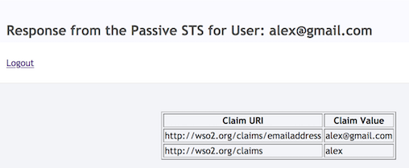

# Configuring Single Sign-On Using WS-Federation

Single sign-on is a key feature of the WSO2 Identity Server that enables
users to access multiple applications using the same set of credentials. This tutorial allows you to have hands-on experience on how to configure SSO with WSO2 Identity Server using WS-Federation (Passive STS) protocol.

To read more about single sign on with WSO2 Identity Server, see [Single Sign On](../../learn/configuring-single-sign-on).

## Scenario

Pickup is a cab company that has two web applications that use WS-Federation. Both applications use WSO2 IS as the identity provider. When SSO is configured for both these applications, an employee is only required to provide their credentials to the first application and the user will be automatically logged in to the second application.

This tutorial demonstrates configuring WS-Federation for one application and retrieving a SAML token that can be used for single sign-on. 

## Set up

1. [Download WSO2 Identity Server](https://wso2.com/identity-and-access-management/).

2. Navigate to `<IS_HOME>/bin` and start the server by executing one of the following commands.

    ``` java tab="Linux/MacOS"
    sh wso2server.sh
    ```

    ``` java tab="Windows"
    wso2server.bat run
    ```
    
3. Log in to the management console using admin/admin credentials and create a new user called "Alex" with login permission. For instructions, see [Adding Users and Roles](../../learn/adding-users-and-roles#create-a-user).

    !!! info
        `admin` is the default administrative user in WSO2 Identity Server.

4. Click **List** under **Users and Roles** and edit Alex's user profile. Enter an email address for Alex.

5. Follow the steps in [deploying **Passive STS** webapp](../../learn/deploying-the-sample-app/#deploying-the-passivestssampleapp-webapp) to download, deploy and register **dispatch** sample.

You are now ready to try out WS-Federation SSO with the Passive STS sample application.

## Try it out

!!! info 
    When redirecting your users to WSO2 IS Passive STS endpoint, the following (optional) parameters are sent in the request from the sample application.

    - **wa=wsignin1.0**: specifies whether WSO2 IS should issue a token for the relying party (this is the default action).
    - **wa=wsignout1.0**: specifies whether WSO2 IS should log the user out.
    - **wreply={replyUrl}**: specifies where the response should be sent to.

    It is recommended to use a Network tracer such as a SAML tracer to analyze the HTTP request and responses in this scenario. With a tracer, you will be able to view the parameters mentioned above and also see the SAML token that is issued from WSO2 IS. 

1. Navigate to one of the following links on your browser and click **Login**.
    - To get a SAML 1.1 token: <http://localhost:8080/PassiveSTSSampleApp/index.jsp>
    - To get a SAML 2.0 token: <http://localhost:8080/PassiveSTSSampleApp?samlv=2-0>

2. Log in using Alex's credentials. You will be redirected to the WSO2 IS Passive STS Service and then redirected back to the configured `replyUrl`.

3. On the screen, you will see the passive STS response with the requested claims. Click **Logout** to logout from the application.
    