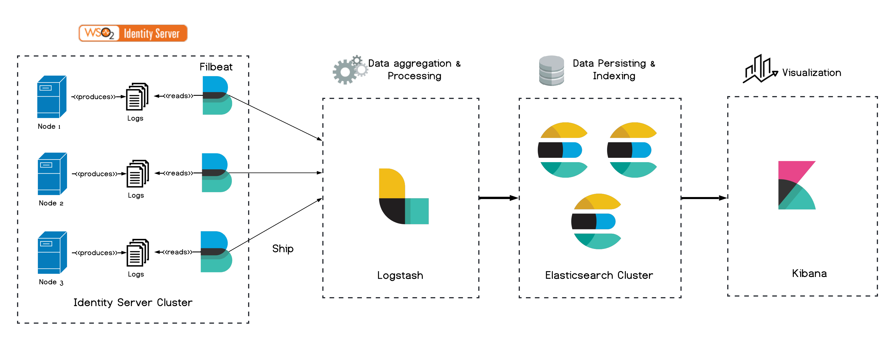

# Analytics

WSO2 Identity Server supports ELK-based Analytics which is considered as
the On-Premise Analytics solution for WSO2 Identity Server.
You can configure WSO2 Identity Server to publish authentication and session
related events to ELK clustor so that you can analyze login and session analytics via Kibana dashaboards.

### Analytics Data flow

WSO2 Identity Server will publish analytics data into a log file and that
file will be used as the source for the ELK Analytics solution.

ELK based WSO2 Identity Server On-Premise Analytics deployment architecture
has 4 main components.

1. Elasticsearch
2. Kibana
3. Logstash
4. Filebeats

Identity server produces the log files. Filebeat monitors the log files locations that we specify, collects log events, and forwards them to logstash. Logstash is a server‑side data processing pipeline that ingests data from multiple sources, transforms it, and then sends it to Elasticsearch. Elasticsearch is the central component of the Elastic Stack and it is a distributed, RESTful search and analytics engine which can be used to store, search, and analyze big volumes of data quickly and in near real time. Kibana is a visualization layer that works on top of Elasticsearch, providing users with the ability to analyze and visualize the data.

ELK-based Analytics provides three dashboards; Auth Dashboard, Session Dashboard, Alert Dashboard to view and analyze the following;

-   **Login analytics** : Includes statistics related to login attempts
    made via WSO2 Identity Server.

    The latest version of WSO2 Identity Server Analytics allows you to
    view and analyze statistics of login attempts made through the
    authentication framework of WSO2 Identity Server. You cannot view
    statistics related to admin console login attempts and grant types
    such as password.

-   **Session analytics** : Includes statistics related to specific
    sessions that get created for different applications accessed via
    WSO2 Identity Server.

    A session is the time duration between a successful log on and the
    subsequent log off by a specific user.

-   **Alerting** : Facilitates alerting so that you can be informed of
    abnormal behavior related to authentication operations carried out
    by WSO2 Identity Server.

For more information on how to work with WSO2 Identity Server Analytics,
explore the following topics:

- [ELK-based Analytics Installation Guide](../../learn/elk-analytics-installation-guide)
