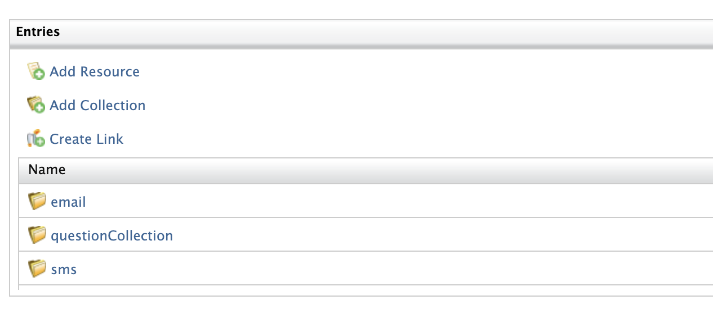
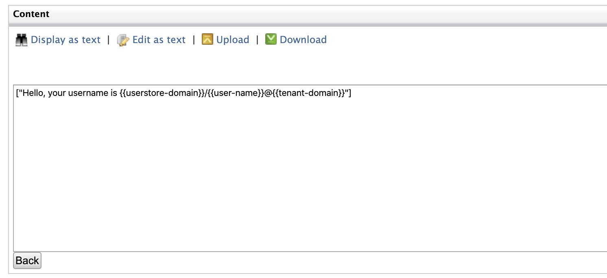

# Managing SMS Notification Templates From the Registry

WSO2 Identity server supports notifications via SMS from WSO2 Identity Server 5.10.0 onwards. This document will 
guide you through the process of adding a new SMS notification template and editing an existing notification template. 

!!! info Before you begin 
    An SMS template can only have following attributes. 
    
        - displayName
        - type
        - locale
        - body
    
        
        
    Having more attributes such as `Footer` or `Subject` will lead for errors.
    
## Adding an SMS notification template

In WSO2 Identity server, the notification templates are packed by default. But if you want to add a new SMS 
notification template, following methods are available.

1. Adding via the configuration files.
2. Adding via the registry of the management console.

### Adding an SMS notification template using configuration files

1. Navigate to <IS_HOME>/repository/conf/sms folder.

2. Click on the sms-templates-admin-config.xml file to view default templates and edit them.

3. Add a new template with allowed attributes. A sample template is given below.

        

!!! note
    If the identity server is running, you need to restart the server to apply the changes.       
     
### Adding an SMS notification template using the registry

1. Log in to the management console and navigate to `Main> Registry> Browse`.

2. In the `tree view` tab, click on `system>config>identity`.     

      

3. Click `Add Collection` and enter the collection name as `sms`.
    
    (**NOTE:** the names are CASE SENSITIVE)   
    
         
    
4. Click on the `sms` directory and click `Add Collection` and enter the collection name as `accountidrecovery`. 

    (**NOTE:** `accountidrecovery` is the type of the template)    
    
      
    
5. Click on `Add Resource`.

6. Select the method as `Create Text Content`.

7. Provide name as `en_us`.

8. Add the SMS notification template body.

    (**NOTE:** Include placeholders in the SMS template body)
    
    ```
    ["Hello, your username is {{userstore-domain}}/{{user-name}}@{{tenant-domain}}"]
    ```
    
     
    
9. Click on `en_us` resource and add the following properties.

    ```
    display : accountIdRecovery
    type : accountIdRecovery
    locale : en_US
    ```
    
    
10. Click `Finish` to save the new notification template.


## Editing an SMS notification template from the registry

1. Log in to the Management Console and click `Main> Registry> Browse`.

2. On the `tree view` tab, click `system > config >identity > sms > accountidrecovery`.

3. Click on `en_us` to view the template.

4. Click `Display as text` to view the template or click `Edit as text` to edit the template.

    
        