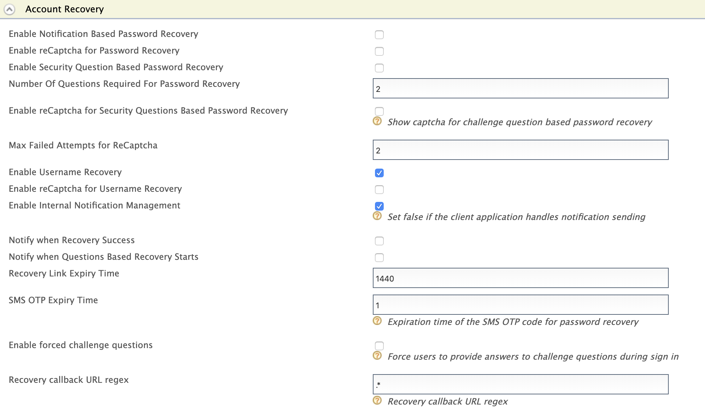
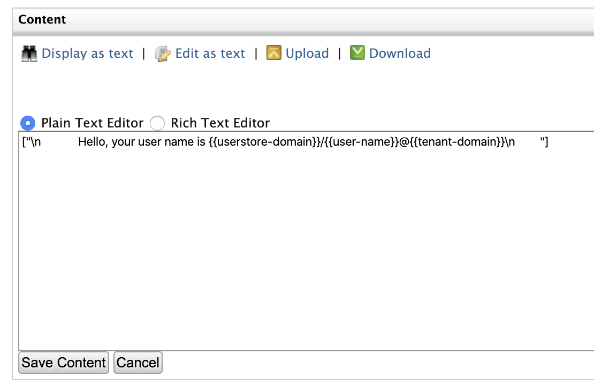

# Username Recovery Via User Preferred Notification Channel

WSO2 Identity Server enables recovering user accounts where the user has forgotten the user name.

!!! Note
    This feature is only available via Account Recovery REST APis. Currently, WSO2 IS does not 
    support this feature via the User Portal.    

**Username Recovery Flow**

 - User provides a set of unique claims to identify the user account.
 - Then the server will prompt available notification channels to the user to receive username 
 recovery notification.
 - User selects a notification channel.
 - Sever send the recovery notification to the user via the preferred notification channel.

The following sections walk you through configuring and trying out username recovery via SMS and Email 
Channels.   

??? Warning "If you have migrated from a previous IS version"
    If you have migrated from a previous IS version, ensure that the `IdentityMgtEventListener` with the
    `         orderId=50        ` is set to **false** and that the Identity
    Listeners with `         orderId=95        ` and
    `         orderId=97        ` are set to **true** in the
    `         <IS_HOME>/repository/conf/deployment.toml        ` file.
   
    !!! Note 
        You can skip this step if there are no entries for `event.default_listener.xxx`, in 
        the `deployment.toml` file.
    
    
    ``` java
    [event.default_listener.identity_mgt]
    priority= "50"
    enable = false
    [event.default_listener.governance_identity_mgt]
    priority= "95"
    enable = true
    [event.default_listener.governance_identity_store]
    priority= "97"
    enable = true
    ```
    
## Configuring username recovery

Following steps given below are to recover a user in the the super tenant, which is `carbon.super`.

1.  Add the following properties to the `deployment.toml` file in the `IS_HOME/repository/conf` folder to 
configure the the identity server to send confirmation emails.
    
    !!! Note
        You need to add this configuration only if you wish to configure WSO2 IS to send confirmation 
        emails. Alternatively, you can use your own email managing mechanism.

    ``` toml
    [output_adapter.email]
    from_address= "wso2iamtest@gmail.com"
    username= "wso2iamtest"
    password= "Wso2@iam70"
    hostname= "smtp.gmail.com"
    port= 587
    enable_start_tls= true
    enable_authentication= true
    ```    
    
2. Add the following properties to the `deployemnt.toml`. Property `recovery_code_validity` will 
determine the validity period of the recovery code given after initiating username/password recovery.

    ```toml
    [identity_mgt.notification_channel_recovery]
    recovery_code_validity=2
    ```
    
    !!! Note
        - Default value of the field is `1` minute.
        - If you have configured Password Recovery Via User Preferred Notification Channel, the above 
          field might be already configured.
          
3.  Add an event publisher to `<IS_HOME/repository/deployment/server/eventpublishers`. For this 
sample, `http output adapter` is used. Following is a sample publisher to call a REST Service 
to send confirmation codes.

    ??? info "Sample Event Publisher"
        ```
        <?xml version="1.0" encoding="UTF-8"?>
        <eventPublisher name="HTTPOutputEventAdapter" processing="enable"
            statistics="disable" trace="disable" xmlns="http://wso2.org/carbon/eventpublisher">
            <from streamName="id_gov_sms_notify_stream" version="1.0.0"/>
            <mapping customMapping="enable" type="json">
                <inline>{"api_key"="4c9374",
                    "api_secret"="FtqggE93",
                    "from"="NEXMO",
                    "to"={{mobile}},
                    "text"={{body}}
                    }</inline>
            </mapping>
            <to eventAdapterType="http">
                <property name="http.client.method">httpPost</property>
                <property name="http.url">https://rest.nexmo.com/sms/json</property>
            </to>
        </eventPublisher>
        ``` 
        
        !!! note
            This publisher uses NEXMO as the SMS REST service provider. For more information 
            on writing a custom http event publisher, see [HTTP Event Publisher](https://docs.wso2.com
            /display/DAS300/HTTP+Event+Publisher).  
            
4.  [Start WSO2 IS](../../setup/running-the-product#starting-the-server)
    and [log in to the management console](../../setup/running-the-product#accessing-the-management-console)
    : ` https://<IS_HOST>:<IS_PORT>/carbon `.  
    **NOTE:** If your IS is already running, make sure to restart to apply above configurations. 
    
5.  Navigate to `Main -> Identity Providers -> Resident -> Account Management Policies` section.

6.  Expand the `Account Recovery` section and configure the following properties. 

    
    
    <table>
        <thead>
            <tr class="header">
                <th>Field</th>
                <th>Description</th>
            </tr>
        </thead>
        <tbody>
            <tr class="odd">
                <td>Enable Username Recovery</td>
                <td>Enable username recovery for the current tenant domain</td>
            </tr>
            <tr class="odd">
                <td>Enable Internal Notification Management</td>
                <td>
                    <p>
                        Select to configure Identity server to send confirmation emails to the user.
                        If the client application handles notification sending already, unselect it. 
                    </p>
                </td>
            </tr>
        </tbody>    
    </table>

## Managing Notification templates

### Managing EMAIL Notification templates

The email notification templates are stored in the `IS_HOME>/repository/conf/email/email-admin-config.xml` 
file and they can be edited using the Management Console.

!!! tip
    The **AccountIdRecovery** template is used to send email notifications. You can edit and 
    customize the email template. For more information, 
    see [Customizing Automated Emails](../../learn/customizing-automated-emails).
    
### Managing SMS Notification templates      
    
The templates for SMS notifications are stored in the registry. Follow the steps below to edit the
sms notification template.

1. Log in to the Management Console and click `Main> Registry> Browse`.

2. On the **tree view** tab, click `system -> config ->identity -> sms -> accountidrecovery`.

3. Click on `en_us` to view the template.

4. Click `Display as text` to view the template or click `Edit as text` to edit the template.
    
    
    
!!! tip
    The **accountidrecovery**, template is used to send SMS notifications. You can edit and customize the SMS template. 
    For more information, 
    see [Managing SMS Notification Templates From the Registry](../../learn/managing-sms-templates-from-the-registry).     
    
## Try out username recovery 


!!! tip "Before you begin"
    Complete the steps given to configure the identity server.


!!! info "Notification Mechanisms"

    WSO2 Identity Server provides the functionality to receive account recovery notifications 
    internally or externally.
    
    1. **Internal Notification Management** : Notification sending is managed by WSO2 Identity Server.
        
    2. **External Notification Management** : Notification sending is managed by an external 
    notification management mechanism.
    
    !!! note
        To configure external notification management, `disable` the property `Enable Internal 
        Notification Management` in `Account Recovery` configurations.
        
        
    
### Creating a user for recovery

!!! tip "Before you begin" 
    Make sure you have a user with Email or Mobile configured. If you already have 
    a user, skip to the next heading. 
    If not follow the steps below to create a new user and assign notification channels.

1. Log in to the Management Console and click `Main -> Identity -> Users and Roles -> Add`.

2. Click on `Add New User` and enter user credentials.

    
    
    !!! Note
        For more details on creating users and roles Click [Adding Users and Roles](../.
        ./learn/adding-users-and-roles/)
    
3. Navigate to `Main -> Identity -> Users and Roles -> List -> Users`.

4. Find the user from the list and click `View Roles`.     
    
    

5. Click on `Permissions` to edit the default permissions.

    

6. From the list of permissions select `Login` permission and click `Update`.     

     
    
    !!! warning
        This will update the permissions of the role. Therefore, all the users with the current role 
        will receive login permissions.

7. Navigate to `Main -> Identity -> Users and Roles -> List -> Users` and click on `User Profile` to 
update the Email and Mobile of the user.

    
    
### **Username recovery with Internal Notification Management**   

1. Use the following command to create a username recovery request.

    ```
    curl -X POST "https://localhost:9443/api/users/v1/recovery/username/init" -H "accept: application/json" -H "Content-Type: application/json" -d "{\"claims\":[{\"uri\":\"http://wso2.org/claims/givenname\",\"value\":\"user1\"}],\"properties\":[{\"key\":\"key\",\"value\":\"value\"}]}"
    ```
     
2.  Following response will be returned by the API.

    ```
    [{
       "mode": "recoverWithNotifications",
       "channelInfo": {
          "recoveryCode": "ced06028-9655-4503-b9a7-17826b80cbd8",
          "channels": [
              {
                "id": "1",
                "type": "EMAIL",
                "value": "s********@g***l.com",
                "preferred": false
              },
              {
                "id": "2",
                "type": "SMS",
                "value": "*******3902",
                "preferred": true
              }
          ]
        },
        "links": [
            {
              "rel": "next",
              "href": "/t/carbon.super/api/users/v1/recovery/username/recover",
              "type": "POST"
            }
        ]
     }]
    ``` 
    
    !!! note
        The validity period of the recovery code is determined by the 2nd step of 
        Configuring Username Recovery.  
    
3. Use the `recoveryCode` and a preferred channel `id` to get notifications via that channel.

    ```
    curl -X POST "https://localhost:9443/api/users/v1/recovery/username/recover" -H "accept: application/json" -H "Content-Type: application/json" -d "{\"recoveryCode\":\"1234-5678-2455-3433\",\"channelId\":\"1\",\"properties\":[{\"key\":\"key\",\"value\":\"value\"}]}"
    ```      
    
4. The API will return the following response upon a successful recovery and the user will be notified 
via the selected channel.

    ```
    {
      "code": "UNR-02001",
      "message": "Username recovery information sent via user preferred notification channel.",
      "notificationChannel": "EMAIL"
    }
    ```    
    
### **Username recovery with External Notification Management**   

1. Use the following command to create a user name recovery request.

    ```
    curl -X POST "https://localhost:9443/api/users/v1/recovery/username/init" -H "accept: application/json" -H "Content-Type: application/json" -d "{\"claims\":[{\"uri\":\"http://wso2.org/claims/givenname\",\"value\":\"user1\"}],\"properties\":[{\"key\":\"key\",\"value\":\"value\"}]}"
    ```    
    
2.  Following response will be returned by the API.

    ```
    [{
      "mode": "recoverWithNotifications",
      "channelInfo": {
          "recoveryCode": "9ed0ed58-593a-48d8-90b3-ae745a6d7aae",
          "channels": [
              {
                "id": "1",
                "type": "EXTERNAL",
                "value": ""
              }
          ]
      },
      "links": [
          {
            "rel": "next",
            "href": "/t/carbon.super/api/users/v1/recovery/username/recover",
            "type": "POST"
          }
      ]
    }]
    ```
    
    !!! note
            The validity period of the recovery code is determined by the 2nd step of 
            Configuring Username Recovery. 

3. Use the `recoveryCode` and a channel `id` to get the recovered username.

    ```
    curl -X POST "https://localhost:9443/api/users/v1/recovery/username/recover" -H "accept: application/json" -H "Content-Type: application/json" -d "{\"recoveryCode\":\"1234-5678-2455-3433\",\"channelId\":\"1\",\"properties\":[{\"key\":\"key\",\"value\":\"value\"}]}"
    ```   
    
4. The API will return the following response upon a successful recovery.

    ```
    {
        "code": "UNR-02002",
        "message": "Username recovery information sent externally.",
        "notificationChannel": "EXTERNAL",
        "username": "sominda2@carbon.super"
    }
    ```
        