# Configuring X509 Certificate Authenticator

This page provides instructions on how to configure the X509 certificate authenticator and the WSO2 Identity Server using a sample app to demonstrate authentication.

## Working with certificates

X509 authentication requires the client to possess a Public Key Certificate (PKC). 

??? info "What is a Public Key Certificate (PKC) and Certificate Authority (CA)?"
    Public key cryptography relies on a public and private key pair to encrypt and decrypt the content. The keys are mathematically related, and content 
    encrypted by using one of the keys can only be decrypted by using the other. The private key is kept secret. The public key is typically embedded in a 
    binary certificate, and the certificate is published to a database that can be reached by all authorized users. The certificate binds the public key 
    to an entity and is used to protect the information, encrypt transactions, and ensure secure communication.

    Certificate Authorities, or Certificate Authorities / CAs, issue Digital Certificates. Digital Certificates are verifiable small data files that contain identity credentials to help websites, people, and devices represent their authentic online identity (authentic because the CA has verified the identity)

If **X509 authentication** is specified, the WSO2 IS will authenticate the client using the client’s public key certificate. To issue the digital certificate, a Certificate Authority (CA) is required. A CA issues digital certificates that contain identity credentials to help websites, people and devices represent their authentic, CA-verified, online identity.

To create a sample certificate and create your own Certificate Authority to sign the certificates, follow the following steps:

1.  The first step is to create the private RSA key:

    ```
    openssl genrsa -out rootCA.key 2048
    ```

    Here, the specified key size is 2048 bit. You can specify the key size for your private key.

2.  Based on this key you can now generate an actual certificate which is valid for 10 years using the following command:

    ```
    openssl req -new -x509 -days 3650 -key rootCA.key -out rootCA.crt
    ```

3.  You are prompted to provide the following details, and the details you provide are incorporated into the certificate request. 
    An example is shown below. Make sure you use the values that fit your use case.

    - Country Name (2 letter code) [AU]: SL
    - State or Province Name (full name) [Some-State]: Western
    - Locality Name (eg, city) [ ]: Colombo
    - Organization Name (eg, company) [Internet Widgits Pty Ltd]: WSO2
    - Organizational Unit Name (eg, section) [ ]: QA
    - Common Name (e.g. serverFQDN or YOUR name) [ ]: wso2is.com 
    - Email Address [ ]: kim@wso2.com

4.  An OpenSSL CA requires new files and supporting directories. Therefore, create a new directory.
    Create the directory structure according to your `openssl.conf` format.

    ```
    mkdir -p demoCA/newcerts
    ```

5.  You also need some initial files inside your CA directory structure.

    ```
    touch demoCA/index.txt
    echo '01' > demoCA/serial
    ```

6.  For the JVM to trust your newly created certificate import your certificate into your JVM trust store by executing the following command:

    ```
    keytool -import -noprompt -trustcacerts -alias rootCA -file rootCA.crt -keystore ${JAVA_HOME}/jre/lib/security/cacerts -storepass changeit
    ```

    !!! info "Got the 'permission denied' error?"
        Note that when adding the certificate to the JVM trust store you may get the permission denied error. Running this command as an administrator resolves this permission issue. 

        For example, if you are a Mac user, you can use sudo in front of this command to fix the permission issue.  

7. Now you have created the CA to sign the certificate. To create the server certificate follow the steps given below:

    1. Create the keystore that includes the private key by executing the following command:

        ```
        keytool -genkey -v -alias localcrt -keyalg RSA -validity 3650 -keystore localcrt.jks -storepass localpwd -keypass localpwd
        ```

        !!! tip
            You are prompted for details after executing the above command. For "What is your first and last name?" you need to give a name without space(e.g., wso2). 

        This command will create a keystore with the following details: 
            - **Keystore name:** localcrt.jks
            - **Alias of public certificate:** localcrt
            - **Keystore password:** localpwd
            - **Private key password:** localpwd (this is required to be the same as keystore password)
    
    2. Execute the following command to generate the certificate signing request(CSR) using the generated keystore file.

        ```
        keytool -certreq -alias localcrt -file localcrt.csr -keystore localcrt.jks -storepass localpwd
        ```

    3.  To enable CRL or OCSP based certificate revocation validation, configure the necessary openSSL extension configurations.

        1.  Open either of the following files.
            -  `validation.cnf`
            -  `/usr/lib/ssl/openssl.cnf`

        2.  Set the following properties under `x509_extensions`.

            ``` java
            crlDistributionPoints = URI:http://pki.google.com/GIAG2.crl
            authorityInfoAccess = OCSP;URI: http://clients1.google.com/ocsp
            ```

    4.  Once it is done, sign the CSR, which requires the CA root key.

        ``` xml
        openssl ca -batch -startdate 150813080000Z -enddate 250813090000Z -keyfile rootCA.key -cert rootCA.crt -policy policy_anything -out localcrt.crt -infiles localcrt.csr
        ```

        This creates a signed certificate called `localcrt.crt` that is valid for a specified period that is denoted by the `startdate` and `enddate`.

    5.  The next step is to import the CA and signed certificate into the keystore.

        ``` xml
        keytool -importcert -alias rootCA -file rootCA.crt -keystore localcrt.jks -storepass localpwd -noprompt
        
        keytool -importcert -alias localcrt -file demoCA/newcerts/01.pem -keystore localcrt.jks -storepass localpwd -noprompt
        ```

    6.  Now, get the `pkcs12` out of `.crt` file using the command given below as it is been used to import certificates to the browser.

        ``` xml
        keytool -importkeystore -srckeystore localcrt.jks -destkeystore localhost.p12 -srcstoretype JKS -deststoretype PKCS12 -srcstorepass localpwd -deststorepass browserpwd -srcalias localcrt -destalias browserKey -srckeypass localpwd -destkeypass browserpwd -noprompt
        ```

        Make sure to use the same password you used when creating the keystore for the `srcstorepass` in the above step. Now you have the `localhost.p12` file that you can import into your browser as explained in the [import certificate](#import-certificate) section.

7.  Next, create a new trust store and import the server certificate into the trust store using the following commands:

    ``` xml
    keytool -import -keystore cacerts.jks -storepass cacertspassword -alias rootCA -file rootCA.crt -noprompt
    keytool -importcert -alias localcrt -file localcrt.crt -keystore cacerts.jks -storepass cacertspassword -noprompt
    ```

    !!! tip "CN"
        The User objects in the LDAP directory hierarchy have designators that start with CN, meaning Common Name. The CN designator applies to all but a few object types. Active Directory only uses two other object designators (although LDAP defines several).

Once you have done the above steps, you have the keystore (`localcrt.jks`), truststore (`cacerts.jks`), and pkcs12 (`localhost.p12`) files that you need to use later on in this guide.

## Configuring the X509 certificate for the app

1.  Download the [WSO2 Identity Server](http://wso2.com/products/identity-server/).

2.  Replace your keystore file path, keystore password, trust store file path and trust store password (you can use the keystore and
    truststore, which you created in the [Working with Certificates](#working-with-certificates) section) in the following configuration and add it to the
    `<IS_HOME>/repository/conf/deployment.toml` file.

    ``` toml 
    [custom_transport.x509.properties]
    protocols="HTTP/1.1"
    port="8443"
    maxThreads="200"
    scheme="https"
    secure=true
    SSLEnabled=true
    keystoreFile="/path/to/keystore.jks"
    keystorePass="keystorepwd"
    truststoreFile="/path/to/truststore.jks"
    truststorePass="truststorespassword"
    bindOnInit=false
    clientAuth="want"
    ssl_protocol = "TLS"
    ```

    !!! note
    
        1.   To function properly, this connector should come first in the order. Otherwise, when mutual SSL takes place, the already existing connector (9443) will be picked up and the certificate will not be retrieved correctly.

        2.  The `clientAuth` attribute causes the Tomcat to require the client with providing a certificate that can be configured as follows.

            -   `true` : valid client certificate required for a connection to succeed
            -   `want` : use a certificate if available, but still connect if no certificate is available
            -   `false` : no client certificate is required or validated
    
        -   The `truststoreFile` attributes specifies the location of the truststore that contains the trusted certificate issuers.
    
## Disabling certificate validation
    
The location that is used to disable certificate validation depends on whether WSO2 Identity Server was started at least once or not.

-   If you have never started WSO2 Identity Server before, the configurations should be made on the `certificate-validation.xml` file.

-   If you have started WSO2 Identity Server at least once, the configurations should be made on the registry parameters.

**Disabling certificate validation in an unstarted WSO2 IS Pack**

Follow the steps below to disable certificate validation if your WSO2 Identity Server pack has never been started.

1.  Open the `certificate-validation.xml` file in the `<IS_HOME>/repository/conf/security` repository.

2.  Disable certificate validation.

    1.  To disable CRL-based certificate validation, set the
        `            enable           ` sub-parameter of the
        `            org.wso2.carbon.identity.x509Certificate.validation.validator.CRLValidator           `
        validator, to `            false           `.
    2.  To disable OCSP-based certificate validation, set the
        `            enable           ` sub-parameter of the
        `            org.wso2.carbon.identity.x509Certificate.validation.validator.OCSPValidato           `
        validator, to `            false           `.

    Example:

    ``` java
    <?xml version="1.0" encoding="ISO-8859-1"?> <CertificateValidation xmlns="http://wso2.org/projects/carbon/certificate-validation.xml">
     <Validators>
     <Validator name="org.wso2.carbon.identity.x509Certificate.validation.validator.CRLValidator" displayName="CRLValidator" enable="false">
                     <Parameter name="priority">1</Parameter>
                     <Parameter name="fullChainValidation">true</Parameter>
                     <Parameter name="retryCount">2</Parameter>
        </Validator>
        <Validator name="org.wso2.carbon.identity.x509Certificate.validation.validator.OCSPValidator" displayName="OCSPValidator" enable="false">
                     <Parameter name="priority">2</Parameter>
                     <Parameter name="fullChainValidation">true</Parameter>
                     <Parameter name="retryCount">1</Parameter>
        </Validator>
    </Validators>
    </CertificateValidation>
    ```

**Disabling certificate validation in an already-started WSO2 IS pack**

Follow the steps below to disable certificate validation if WSO2 Identity Server was started before.

1.  Access the WSO2 Identity Server Management Console.
2.  Click **Main &gt; Registry &gt; Browse**.  
    
3.  Disable CRL certificate validation.
    1.  Locate the CRL parameter by entering
        `            _system/governance/repository/security/certificate/validator/crlvalidator           `
        in the **Location** search box.  
        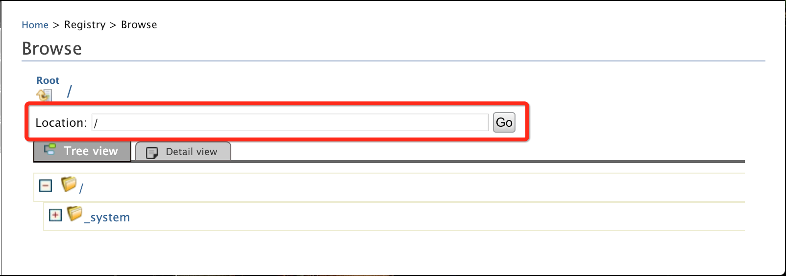
    2.  Expand **Properties**.  
        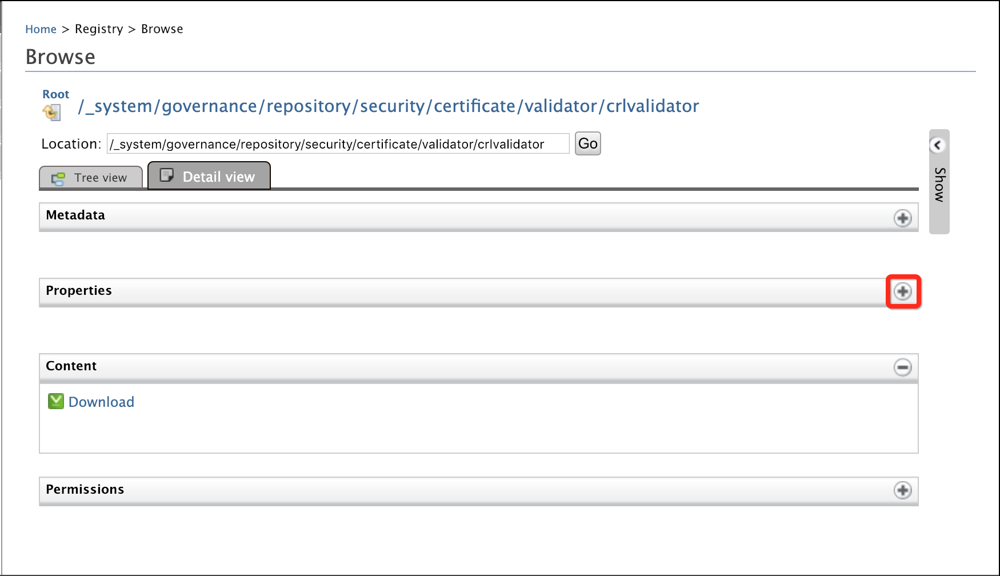
    3.  Click **Edit** pertaining to the **Enable** property.  
        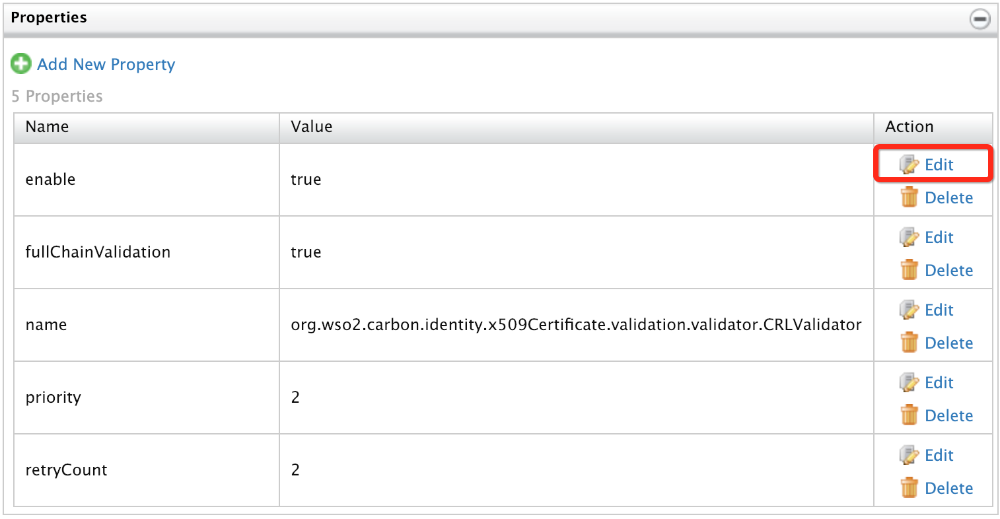  
    4.  Change the value to `            false           ` and click
        **Save**.  
        
4.  Similarly, disable OCSP certificate validation in the
    `          _system/governance/repository/security/certificate/validator/ocspvalidator         `
    registry parameter.

For more information on CRL and OCSP certificate validation, see
[Configuring Certificate Revocation Validation](https://docs.wso2.com/display/ISCONNECTORS/Configuring+Certificate+Revocation+Validation).

## Configuring the Authentication Endpoint

1.  Open the `          deployment.toml         ` file in
    the `          <IS_HOME>/repository/conf/         `
    directory.
2.  Add the following configuration to the file.

    1.  `            authentication_endpoint           ` : This is the
        URL with the port that is secured with the certificate, e.g.,
        `                         https://localhost:8443/x509-certificate-servlet                       `
       . Update this based on your host name.
    2.  `            username           ` : This attribute value will be
        taken as the authenticated user subject identifier. Update this
        with any of the certificate attributes, e.g., CN and Email.
    3. `name` : This attribute identifies the authenticator that is configured as the second authentication step. 
    4. `enable`: This attribute, when set to true makes the authenticator capable of being involved in the authentication process. 

    ``` toml
    [authentication.authenticator.x509_certificate.parameters]
    name ="x509CertificateAuthenticator"
    enable=true
    AuthenticationEndpoint="https://localhost:8443/x509-certificate-servlet"
    username= "CN"
    ```

    !!! note
        When X509 authentication is configured as the second authentication
        step, the certificate will be validated to check whether it is
        associated with the authenticated user in the first authentication
        step. For that, the `           username          ` parameter will
        be used. For that, the authenticated user name considered in the
        first authentication step will be validated with the certificate
        attribute in this property.
    
        When X509 authentication is configured as the first step, this
        certificate attribute will be treated as the authenticated user
        subject identifier.
    

3.  If you are using the identity claim dialect URI to store X509
    certificate, add the following parameter.

    ``` toml
    [authentication.authenticator.x509_certificate.parameters]
    setClaimURI = "http://wso2.org/claims/identity/userCertificate"
    ```

4.  To enable storing the X509 certificate as a user claim, add the
    following parameter.

    ``` toml 
    [authentication.authenticator.x509_certificate.parameters]
    EnforceSelfRegistration = true
    ```

## Adding a claim mapping for the certificate

If storing the certificate as a user claim is enabled, the X509
certificate will be stored as a user claim and verified with the
retrieved certificate from the request.

1.  Sign in to the WSO2 IS Management Console with one of the following
    URLs using `           admin          ` as the **username** and
    **password**.

    ``` java
    For HTTP  --> http://<HTTP_HOST>:9776/carbon
    For HTTPS --> https://<HTTPS_HOST>:9443/carbon
    ```

2.  On the **Main** tab, click **Claims &gt; Add**.  
    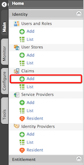
3.  Click **Add Local Claim**.  
    
4.  Add a new claim for the **certificate** by giving the details as
    below, e.g., select a mapped attribute for the claim that is
    supported by the underlying database type.
    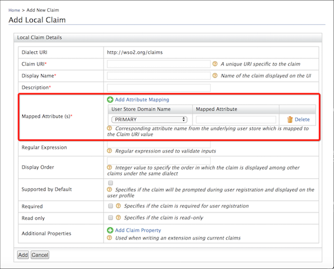
5.  Click **Add**.

## Updating the column size of the database for X509 certificates

Make note of the following points and configure your database to match
your use case:  
  
-   [Disabling Certificate Validation in an Unstarted WSO2 IS
    Pack](#disabling-certificate-validation)
-   [Disabling Certificate Validation in an Already-started WSO2 IS
    Pack](#Disabling-Certificate-Validation)

## Deploying travelocity.com sample app

The next step is to deploy the travelocity.com sample app to use it in
this scenario.

See the topic on [deploying the travelocity.com sample
app](https://docs.wso2.com/display/ISCONNECTORS/Deploying+the+Sample+App)
for information on how to configure this.

## Configuring the service provider

The next step is to configure the service provider.

1.  Return to the management console.
2.  In the **Service Providers** section under the **Main** tab, click
    **Add**.
3.  Since you are using Travelocity as the sample, enter travelocity.com
    in the **Service Provider Name** text box and click **Register**.
4.  In the **Inbound Authentication Configuration** section, click
    **Configure** under the **SAML2 Web SSO Configuration** section.
5.  Now set the configuration as follows:  
    1.  **Issuer** : travelocity.com
    2.  **Assertion Consumer URL** :
        http://localhost:8080/travelocity.com/home.jsp
6.  Select the following check-boxes:
    1.  **Enable Response Signing**.
    2.  **Enable Single Logout**.
    3.  **Enable Attribute Profile**.
    4.  **Include Attributes in the Response Always**.

    
    
7.  Click **Update** to save the changes. Now you will be sent back to
    the **Service Providers** page.
8.  Go to the **Local and Outbound Authentication Configuration**
    section.
9.  You have two options here. You can add X509 certificate
    authenticator as the first factor and also as the second factor.
    
    1.  Second factor  
        1.  Select the **Advanced** configuration radio button option.

        2.  Add the **basic** authentication as a first step and
            **X509Certificate** authentication as the second step.  
            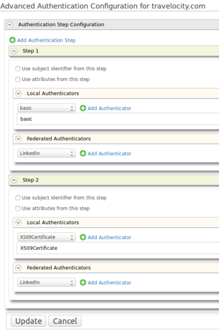

    2.  First factor
        -   Select **Local Authentication** as the **Authentication
            Type** and select **X509Certificate** from the drop-down
            list.  
            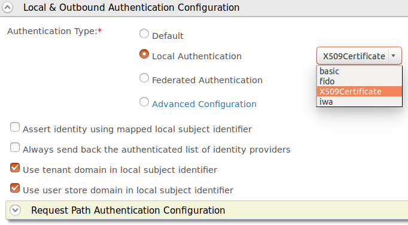
        -   When using X509 as first step authentication, you need to
            create a user in IS management console with the Email
            provided while creating the browser certificate.  
            Example:  
            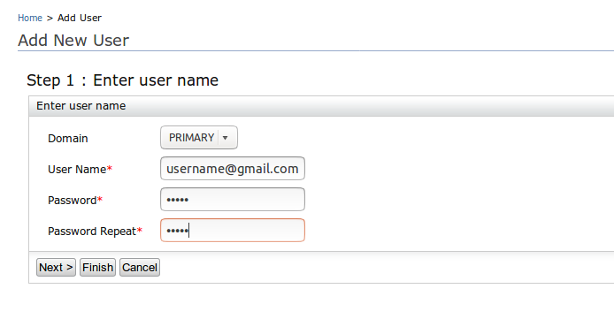

            !!! note
                For more information on creating users from the Email address as the username 
                in management console, refer
                [here](../../learn/using-email-address-as-the-username).
            
10. Finally, click on **Update** to finish the service provider
    configurations.

You have now added and configured the service provider.

## Configuring CRL Caching

CA provides a CRL that is valid for a limited duration, which is defined
in the **Next Update** CRL field. This field indicates the date by which
the next CRL will be issued. According to the [Internet X.509 PKI
Certificate and CRL Profile](https://tools.ietf.org/html/rfc5280) , the
next CRL could be issued before but not later than the indicated date.
This property is considered to validate the returned CRL from cache as a
certificate in the CRL can be temporarily invalidated (Hold) rather than
being irreversibly revoked, i.e., an outdated CRL creates a security
exposure.

The X509CRL is downloaded from the CRL URL and persisted in cache.
Follow the steps below to configure CRL caching.

1.  Open the `deployment.toml` file located in the `          <IS_HOME>/repository/conf/        ` directory.
2.  Add the following configuration.

    ``` toml
    [[cache.manager]]
    name="CRLCache"
    timeout="900"
    capacity="5000"
    ```

## Import certificate

-   **Chrome**
    1.  In your browser, navigate to **Settings &gt; HTTPS/SSL &gt; Manage
    certificates**.  
    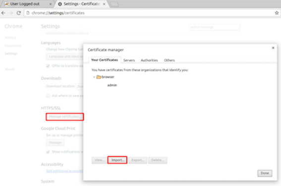
    2.  Click on **Import,** select the **localhost.p12** file, and then
    click **Open**. Note that you may have to enter the password that
    you used to generate the p12 file, (browserpwd) to open it.

-   **Firefox**
    1.  Click on the menu option on the right of the screen and select
        **Preferences**.  
    
        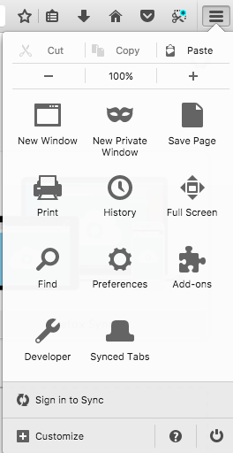

    2.  Click Privacy & Security in the left navigation and scroll down to
        the **Certificates** section. Click **View Certificates**.  
        
        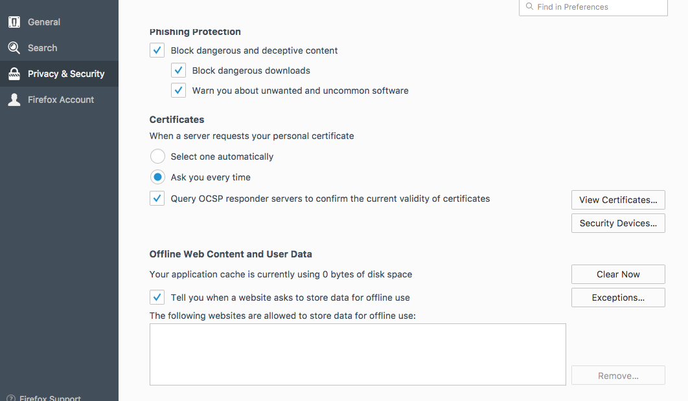
    3.  In the window that appears, click **Import**.  
        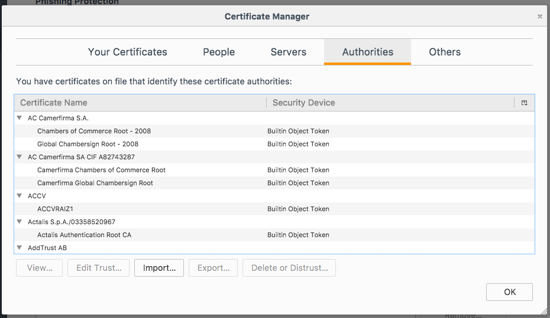
    4.  Select the **localhost.p12** file, and then click **Open**. Note
        that you may have to enter the password that you used to generate
        the p12 file, (browserpwd) to open it.

## Testing the sample

1.  To test the sample, go to the following URL:
    `          http://<TOMCAT_HOST>:<TOMCAT_PORT>/travelocity.com/index.jsp         `
    E.g., http://localhost:8080/travelocity.com
2.  Click the link to log in with SAML from WSO2 Identity Server.

    !!! note
        If you have set this up as the first factor you will not
        get basic authentication.
      
    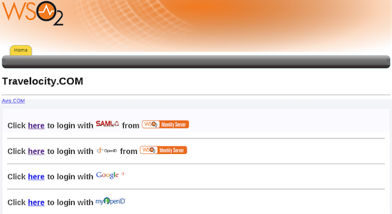

3.  The basic authentication page appears unless it is not set as the
    first factor. Use your username and password and click **Sign In**
    (Only for the second step).  
    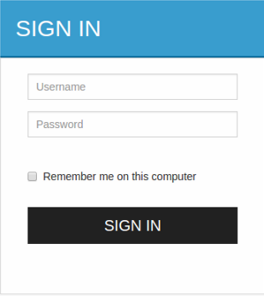
4.  You are directed to the X509 certificate authentication page (
    `          https://localhost:8443/x509-certificate-servlet         `
    ). If the authentication is successful, you will be taken to the
    home page of the travelocity.com app.  
    

  

## Extending the authenticator

Now that you have learned how to configure the authenticator, let's
learn how to extend its functionality for additional authentication
methods.

-   Authenticating using the Subject Alternative Name
-   Authenticating using the RDN

### Authenticating using the Subject Alternative Name

**About Subject Alternative Name**

The Subject Alternative Name (SAN) is an extension to the X.509
certificate format that enables securing multiple hostnames such as CN,
IP, DNS and email, using a single certificate.

!!! note "How SAN works in WSO2 Identity Server"  
    -   If SAN is not enabled, the system does not check for alternative
        names in the certificate.
    -   If SAN is enabled with either of the following, the system throws an
        error fails the authentication process:
        -   Alternative names are not defined in the certificate.
        -   No matching string is found for the alternative name pattern
            that is defined in the certificate.
        -   There are multiple matching strings found for the alternative
            name pattern that is defined in the certificate.
    -   If SAN is enabled where a single match is found for the alternative
        name pattern that is defined in the certificate, that match is used
        as the user name and the system begins user authentication. When a
        user with the given user name is found in the system, the user gets
        authenticated.ated.
    

To enable SAN in WSO2 Identity Server, add the following configurations
to the `         deployment.toml        ` file in the
`         <IS_HOME>/repository/conf/       ` directory.

``` toml
[authentication.authenticator.x509_certificate.parameters]
AlternativeNamesRegex="^[a-zA-Z]{3}$"
```

### Authenticating using the RDN

-   **Relative Distinguished Name (RDN)**  
    An RDN comprises one or more certificate attribute-value pairs in
    the form of `            <attribute>=<value>           `.

    **Sample RDN**

    ``` java
    cn=John Doe+o=WSO2
    ```

    In the above example, the two attribute-pairs,
    `            cn=John Doe           ` and
    `            c=US           ` are separated by a plus (+) sign.

-   **Distinguished Name (DN)**  
    A DN is a sequence of comma-separated RDNs, i.e., RDNs are the
    components of a DN.

    **Sample DN**

    ``` java
    cn=Jon Doe+o=WSO2, c=US
    ```

!!! note "How DN/RDN works in WSO2 Identity Server" 
    When this is configured, the system checks for a matching string from
    the subject DN. Once found, it is used as the user name to proceed with
    user authentication. If more than one matching values or no matching
    values are found, the system throws an error and fails the
    authentication process.
    

To enable subject DN in WSO2 Identity Server, add the following
configuration to the `deployment.toml` file in the
`         <IS_HOME>/repository/conf/       ` directory.

``` toml
[authentication.authenticator.x509_certificate.parameters]
UsernameRegex="[a-zA-Z]{3}"
```
