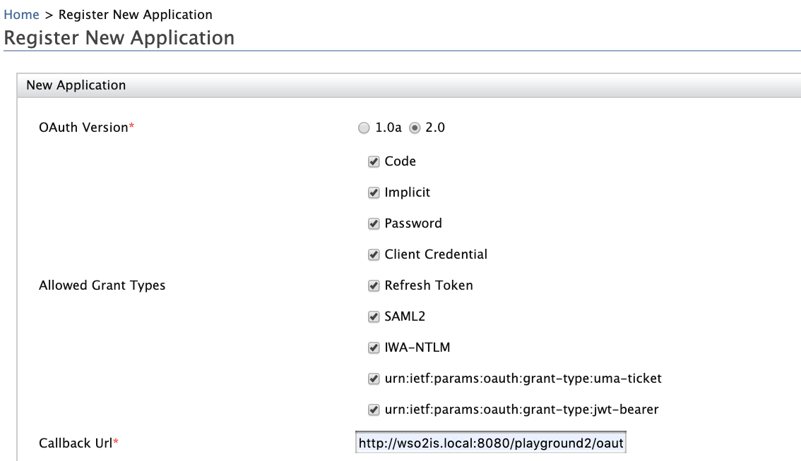

{!samples/deploying-sample-apps.md!}

----

## Register a service provider

1. Log in to the [Management Console](https://localhost:9443/carbon/) using admin/admin credentials. 

2. Click **Service Providers >Add** and enter "playground2" as the **Service Provider Name** and click **Register**.
         
    
3.  Expand the **Inbound Authentication Configuration** section and then the **OAuth/OpenID Connect Configuration** and click
    **Configure.**   

4. Select the relevant grant types that you wish to try out from the **Allowed Grant Types** list. 
        
5.  Enter `http://wso2is.local:8080/playground2/oauth2client` as the **Callback Url**.
    
    

    !!! tip
        For more information on `Callback Url` field and other advanced configurations
        refer, [Advanced OpenID Connect Configurations](../../authenticate/oauth-app-config-advanced)
        
6.  Click **Add**. Note that the **OAuth Client Key** and **Client Secret** get generated. You will need these values later on when deploying the sample application.

7.  Click the **Register** button to finish creating the service provider.

----

## Download the sample

To be able to deploy a WSO2 Identity Server sample, you need to download
it onto your machine first.

Follow the instructions below to download the sample from GitHub.

1. Navigate to [WSO2 Identity Server Samples](https://github.com/wso2/samples-is/releases).

2. [Download](https://github.com/wso2/samples-is/releases/download/v4.1.0/playground2.war)
   the `playground2.war` file from the latest release assets.

----

## Deploy the sample web app

Deploy this sample web app on a web container.

1.  Copy the `playground2.war` file from the latest release assets
    folder into the `<TOMCAT_HOME>/apache-tomcat-<version>/webapps` folder.

2.  Start the Tomcat server.

	!!! note 
		To check the sample application, navigate to
		`http://<TOMCAT_HOST>:<TOMCAT_PORT>/playground2/oauth2.jsp`
		on your browser.

		For example,
		`http://localhost:8080/playground2/oauth2.jsp`

3.	Update the `                    param-value                   `
	parameter in the
	`                    WEB-INF/web.xml                   `
	file with the server URL of WSO2 Identity Server if
	required.  

	Make sure to enter the port the application is running on,
	in the URL. If you have started the Identity Server with a
	port offset, then the respective port needs to be
	configured here.

	``` java
	<init-param>
		<description>serverUrl</description>
		<param-name>serverUrl</param-name>
		<param-value>https://localhost:9443/services/</param-value>
	</init-param>
	```
	
	!!! Note 
		Note that `localhost` is the server that hosts WSO2 Identity
		Server and `9443` is the default SSL port of it. Since playground application is accessing the admin
		service `OAuth2TokenValidationService`, you should have the
		correct serverUrl, username, and password.
		
4.	Update
	**`                     param-value                    `**
	parameter with credentials of an admin user if required.

	``` java
	<init-param>
		<description>userName</description>
		<param-name>userName</param-name>
		<param-value>admin</param-value>
	</init-param>
	<init-param>
		<description>password</description>
		<param-name>password</param-name>
		<param-value>admin</param-value>
	</init-param>
	```

5.	Restart Apache Tomcat and access
	`                    http://wso2is.local:8080/playground2/                   ` .

	By default Tomcat runs on port 8080. If you have configured
	it to run on a different port make sure to update the URL
	and then access the playground application.  

6. You are directed to the landing page of the sample application. Click on **Import Photos** and the following
page appears.  

	

	!!! tip "Troubleshooting tip"

		If you are getting the following error, the sample applications do not have a keystore in them.
		Therefore, you may get this error after changing the tomcat hostname because the public key of the WSO2 Identity Server does
		not exist in the Java certificate store.

		``` java
		javax.net.ssl.SSLHandshakeException: sun.security.validator.ValidatorException: PKIX path building failed: 			sun.security.provider.certpath.SunCertPathBuilderException: unable to find valid certification path to requested target
		```


