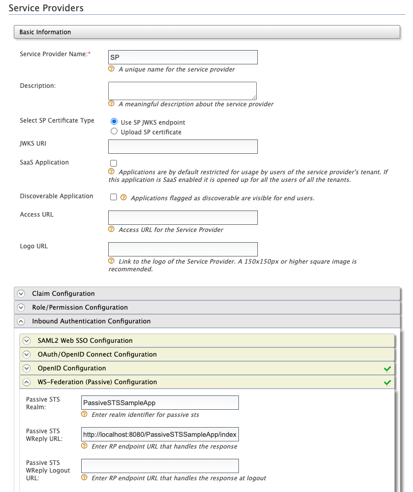

# Configuring WS-Federation Single Sign-On

WSO2 Identity Server's passive security token service (Passive STS) is used as the WS-Federation implementation. The Passive STS is capable of issuing SAML 1.1 and 2.0 security tokens.

!!! info 
	To request a SAML 2.0 security token, the Request Security Token (RST) should be sent to the passive STS
	 endpoint with the TokenType 'SAMLV2.0' when sending the token request. If there is no RST specified, 
	 WSO2 Identity Server will issue a SAML 1.1 token by default.

!!! Tip "Before you begin"	
    You must first
    [register a service provider](../../learn/adding-and-configuring-a-service-provider/#adding-a-service-provider).
    To register a service provider:
	 
	 1. Sign in to WSO2 Identity Server Management Console as an admin.
	 2. On the Main menu, click **Identity** > **Service Providers** > **Add**.
	 3. Enter a service provider name.
	 4.	Click Register. The Service Provider Details page appears.

To configure WS-Federation SSO:

1.  Expand the **Inbound Authentication Configuration** followed by the
    **WS-Federation (Passive) Configuration** section and provide the
    following values. 

    -   **Passive STS Realm** - This should be a unique identifier for
        the web app. Provide the same realm name given to the web app
        you are configuring WS-Federation for.

    -   **Passive STS WReply URL** - Provide the URL of the web app you
        are configuring WS-Federation for.  This endpoint URL will
        handle the token response.
    
    - **Passive STS WReply Logout URL** - Provide the URL of the web app to which 
      users will be redirected to upon logout.  This URL will
      be used to validate the wreply url sent in the logout request.

        !!! tip
        
                If you want to configure an expiration time for the security
                token, you need to add the following configuration in the
                `             <IS_HOME>/repository/conf/deployment.toml             `
                file, under the `             <Server>            ` element:
        
                ``` java
                [sts]
                time_to_live = "8000"
        		```

     Here, the expiration time should be specified in milliseconds.

    

2.  Expand the **Claim Configuration** section and map the relevant
    claims. See [Configuring Claims for a Service
    Provider](../../learn/configuring-claims-for-a-service-provider) for more
    information.
3.  Click **Update** to save changes.

!!! tip
    Currently the signing algorithm used for passive STS by default is `rsa-sha1` and the digest algorithm used is `sha1`. To change the default algorithms, add the following configuration in the `deployment.toml` file found in the <IS_HOME>/repository/conf directory. The example given below sets the signing algorithm to `rsa-sha256` and the digest algorithm to `sha256`.

    ```toml
    [sts]
    signature_algorithm = "http://www.w3.org/2001/04/xmldsig-more#rsa-sha256"
    digest_algorithm = "http://www.w3.org/2001/04/xmlenc#sha256"
    ```


!!! info "Related Topics" 
    -   To test out WSO2 Identity Server's passive security token service
    using a sample, see [Configuring Single Sign On Using WS-Federation](../../learn/configuring-single-sign-on-wsfed).
